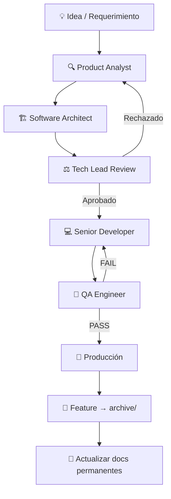

# 🤖 ai-agents — AI-Assisted Development Operating System

> Una biblioteca reutilizable de agentes, plantillas, workflows y checklists para desarrollo de software asistido por IA.  
> Diseñada para evolucionar. Construida para durar.

---

## 🎯 Objetivo

`ai-agents` es el **sistema operativo de desarrollo asistido por IA** para proyectos profesionales.

En lugar de improvisar prompts o depender de respuestas genéricas, este repositorio define:

- **Quién hace qué** (agentes especializados con roles claros)
- **Cómo se trabaja** (workflows reproducibles)
- **Qué se valida** (checklists por área)
- **Cómo se documenta** (templates estructurados)
- **Cómo se reutiliza** (entre proyectos, vía Git Submodules)

---

## 🧠 Filosofía de Trabajo

| Principio | Descripción |
|-----------|-------------|
| **Única Fuente de Verdad** | Los agentes viven en este repositorio, no en cada proyecto |
| **Roles Claros** | Cada agente tiene responsabilidades definidas y límites explícitos |
| **Flujo Estructurado** | El trabajo sigue un pipeline: Analyst → Architect → Tech Lead → Developer → QA |
| **Reutilización** | Templates y checklists son agnósticos al proyecto |
| **Evolución Gradual** | El repositorio crece con cada proyecto real |
| **Sin Duplicación** | Los proyectos referencian, no copian |
| **Actualización > Creación** | Un documento existente actualizado vale más que uno nuevo |

---

## 👥 Roles de los Agentes

| Agente | Archivo | Responsabilidad Principal |
|--------|---------|--------------------------| 
| **Product Analyst** | [`roles/analyst.md`](roles/analyst.md) | Transforma ideas en especificaciones funcionales claras |
| **Software Architect** | [`roles/architect.md`](roles/architect.md) | Diseña soluciones técnicas escalables |
| **Tech Lead** | [`roles/tech-lead.md`](roles/tech-lead.md) | Supervisa, coordina y toma decisiones técnicas |
| **Senior Developer** | [`roles/developer.md`](roles/developer.md) | Implementa siguiendo la arquitectura aprobada |
| **QA Engineer** | [`roles/qa.md`](roles/qa.md) | Valida calidad antes de producción |
| **DevOps Engineer** | [`roles/devops.md`](roles/devops.md) | CI/CD, deployments, infraestructura *(bajo demanda)* |

### Restricciones por Diseño

Cada agente tiene **constraints explícitos** que definen lo que **NO** puede hacer. Esto evita que un agente invada el rol de otro, manteniendo separación de responsabilidades.

Cada agente también tiene una sección **Documentation Rules** que establece cuándo crear documentos, cuándo actualizar, y cómo identificar información permanente vs. temporal.

---

## 📁 Estructura de Carpetas

```
ai-agents/
│
├── roles/                    # Definiciones de agentes (v2.0)
│   ├── analyst.md             # Product Analyst
│   ├── architect.md           # Software Architect
│   ├── tech-lead.md           # Tech Lead (supervisor y árbitro)
│   ├── developer.md           # Senior Developer
│   ├── qa.md                  # QA Engineer
│   ├── devops.md              # DevOps Engineer (especializado, bajo demanda)
│   ├── prompt-guide.md        # Guía de prompts para usar los agentes
│   └── README.md
│
├── templates/                 # Plantillas reutilizables para documentos de proyecto
│   ├── feature-spec.md        # Especificación funcional
│   ├── architecture-spec.md   # Diseño técnico
│   ├── technical-task.md      # Tarea para el Developer
│   ├── qa-report.md           # Reporte de QA
│   ├── bug-report.md          # Reporte de bug
│   ├── project-context.md     # Contexto del proyecto (.ai/context.md)
│   └── feature-folder-template.md  # Estructura de carpeta por feature
│
├── checklists/                # Checklists por área técnica
│   ├── frontend-review.md
│   ├── backend-review.md
│   └── database-review.md
│
├── workflows/                 # Flujos de trabajo para escenarios comunes
│   ├── new-feature.md         # Pipeline completo de nueva feature
│   ├── bug-fix.md             # Proceso de corrección de bugs
│   ├── refactor.md            # Refactorización sin cambio de comportamiento
│   ├── release.md             # Proceso de deployment a producción
│   └── architecture-change.md # Cambios estructurales del sistema
│
├── docs/                      # Documentación del repositorio
│   ├── agent-definitions.md   # Estándar de diseño de agentes
│   ├── repository-structure.md
│   ├── agent-lifecycle.md
│   ├── versioning-strategy.md
│   ├── project-integration.md
│   ├── roadmap.md
│   ├── documentation-strategy.md   # 📋 Estrategia documental del sistema
│   ├── naming-conventions.md       # 📋 Convenciones FEAT-001, BUG-001, ARCH-001
│   └── project-ai-structure.md     # 📋 Guía de la estructura .ai/ por proyecto
│
├── .gitignore
├── CHANGELOG.md               # Historial de cambios del repositorio
└── README.md
```

---

## 📂 Sistema Documental

### El problema que resuelve

Los agentes que generan documentos arbitrariamente producen: crecimiento descontrolado de archivos, duplicación de conocimiento, información obsoleta y ruido para la IA al consumir contexto.

### El modelo de dos niveles

**A. Conocimiento Permanente** — vive en `.ai/` en la raíz del proyecto:

```
.ai/
├── context.md          # Identidad del proyecto, stack, convenciones
├── business-rules.md   # Reglas de negocio permanentes del dominio
├── architecture.md     # Arquitectura actual del sistema (única versión vigente)
├── decisions.md        # Log de decisiones arquitectónicas (ARCH-NNN)
└── glossary.md         # Términos del dominio con definiciones acordadas
```

**B. Trabajo por Feature** — cada iniciativa en su propio espacio:

```
.ai/features/
├── FEAT-001-seat-layout/
│   ├── spec.md
│   ├── architecture.md
│   ├── qa.md
│   └── decision.md
└── FEAT-002-user-notifications/
    └── ...
```

### Las 5 Reglas Documentales

| Regla | Enunciado |
|-------|-----------|
| **R1** | Antes de crear un documento nuevo, verificar si existe uno equivalente que deba actualizarse |
| **R2** | Priorizar actualización sobre creación |
| **R3** | Nunca crear `architecture-v2.md`, `architecture-final.md` — actualizar el existente |
| **R4** | Las features son el único lugar donde pueden existir documentos de una iniciativa específica |
| **R5** | Los documentos raíz representan el estado actual del sistema, no una versión histórica |

Ver [`docs/documentation-strategy.md`](docs/documentation-strategy.md) para la guía completa.  
Ver [`docs/project-ai-structure.md`](docs/project-ai-structure.md) para la estructura `.ai/` detallada.

---

## 🔄 Flujo de Trabajo Recomendado



### Descripción del Flujo

1. **Analyst** — Clarifica el requerimiento, crea `.ai/features/FEAT-XXX/spec.md`
2. **Architect** — Diseña la solución, crea `.ai/features/FEAT-XXX/architecture.md`
3. **Tech Lead** — Revisa y aprueba
4. **Developer** — Implementa siguiendo la arquitectura aprobada
5. **QA** — Valida, crea `.ai/features/FEAT-XXX/qa.md`
6. **Producción** — Solo si QA emite PASS
7. **Cierre** — Feature a `archive/`, documentos permanentes actualizados si aplica

---

## 🏷️ Convenciones de Nomenclatura

| Tipo | Formato | Ejemplo |
|------|---------|---------|
| Feature | `FEAT-NNN-slug` | `FEAT-001-seat-layout` |
| Bug | `BUG-NNN-slug` | `BUG-023-double-booking` |
| ADR | `ARCH-NNN` | `ARCH-012` |
| Branch feature | `feat/NNN-slug` | `feat/001-seat-layout` |
| Branch fix | `fix/NNN-slug` | `fix/023-double-booking` |

Ver [`docs/naming-conventions.md`](docs/naming-conventions.md) para las convenciones completas.

---

## 💻 Integración con IDEs

### Cursor / Windsurf / Cline

Cada proyecto que use `ai-agents` debe tener una carpeta `.ai/` en su raíz:

```
mi-proyecto/
└── .ai/
    ├── context.md              # Contexto del proyecto
    ├── business-rules.md       # Reglas de negocio del dominio
    ├── architecture.md         # Arquitectura actual
    ├── decisions.md            # Log de decisiones
    ├── glossary.md             # Glosario del dominio
    ├── features/               # Trabajo activo por feature
    ├── archive/                # Features completadas (read-only)
    ├── sessions/               # Sesiones de trabajo guardadas
    └── agents -> ../ai-agents/ # Symlink o submodule al repo compartido
```

### Reglas de Cursor (`.cursorrules`)

```markdown
Cuando trabajes en este proyecto:
1. Lee `.ai/context.md` para entender el proyecto
2. Lee `.ai/architecture.md` para entender la arquitectura actual
3. Consulta `.ai/business-rules.md` antes de definir comportamientos
4. Usa los agentes de `.ai/agents/roles/` según el tipo de tarea
5. Sigue los workflows de `.ai/agents/workflows/`
6. Trabaja dentro de `.ai/features/FEAT-XXX/` para la feature actual
7. Nunca crees documentos fuera de `.ai/features/FEAT-XXX/` salvo que corresponda actualizar un documento permanente
```

---

## 🔗 Integración con Proyectos vía Git Submodules

```bash
# Agregar ai-agents como submodule en un proyecto
git submodule add https://github.com/ezequielmendoza-dev/ai-agents.git .ai/agents

# Inicializar en un proyecto clonado
git submodule update --init --recursive

# Actualizar a la última versión
git submodule update --remote .ai/agents
```

Ver [`docs/project-integration.md`](docs/project-integration.md) para instrucciones completas.

---

## 🧪 Ejemplos de Uso

### Crear una nueva feature

```markdown
# Paso 1: Asignar FEAT-NNN y crear la carpeta
mkdir -p .ai/features/FEAT-001-nombre
touch .ai/features/FEAT-001-nombre/spec.md

# Paso 2: Activar Analyst
Actúa como el agente Product Analyst definido en .ai/agents/roles/analyst.md.
Contexto del proyecto: [contenido de .ai/context.md]
Feature: FEAT-001 — [descripción del requerimiento]
```

### Reportar un bug

```markdown
# Activar QA para documentar el bug
Actúa como el agente QA Engineer definido en .ai/agents/roles/qa.md.
Contexto del proyecto: [contenido de .ai/context.md]
Necesito documentar: BUG-001
Descripción del comportamiento incorrecto: [descripción]
```

### Revisar código o diseño

```markdown
# Activar Tech Lead
Actúa como el agente Tech Lead definido en .ai/agents/roles/tech-lead.md.
Contexto del proyecto: [contenido de .ai/context.md]
Estoy presentando para revisión: [feature-spec / arch-spec / implementación]
[contenido del documento a revisar]
```

---

## 🚀 Integración Futura con MCP

Este repositorio está diseñado para evolucionar hacia un **MCP Server propio** que exponga los agentes como herramientas accesibles desde cualquier IDE o sistema multiagente.

Ver [`docs/roadmap.md`](docs/roadmap.md) para el plan evolutivo completo.

---

## ✅ Buenas Prácticas

- **Siempre empieza con el Analyst** — evita implementar sin especificaciones claras
- **El Tech Lead es el árbitro** — si hay conflicto entre Analyst y Architect, el Tech Lead decide
- **Completa los checklists** — no son opcionales antes de un release
- **Actualiza, no dupliques** — si el documento existe, actualizarlo es la respuesta correcta
- **Documenta los ejemplos** — cada feature real es un ejemplo potencial para el repositorio
- **Versiona los cambios a agentes** — usa tags de Git para marcar versiones estables
- **Mantén `.ai/context.md` actualizado** — es la memoria compartida del proyecto
- **Archiva las features completadas** — mueve `FEAT-XXX/` a `archive/` después de cada release

---

## 📌 Versión Actual

| Campo | Valor |
|-------|-------|
| Versión | `v1.1.0` |
| Estado | Estable |
| Última actualización | Junio 2026 |

---

*Construido para pensar en grande, empezar en pequeño y escalar sin límites.*
