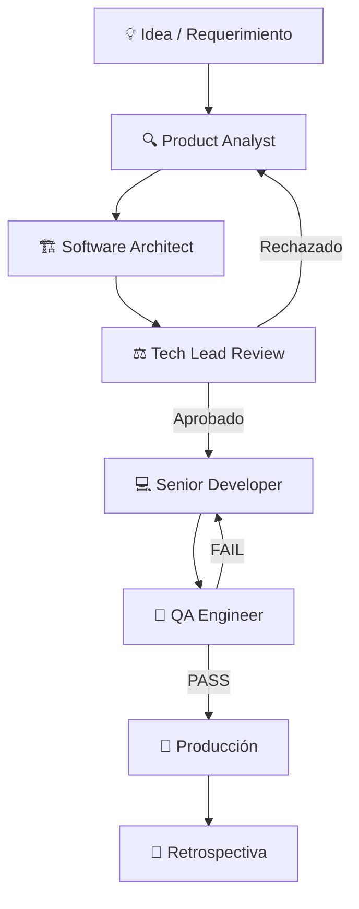

# 🤖 ai-agents — AI-Assisted Development Operating System

> Una biblioteca reutilizable de agentes, plantillas, workflows y checklists para desarrollo de software asistido por IA.  
> Diseñada para evolucionar. Construida para durar.

---

## 🎯 Objetivo

`ai-agents` es el **sistema operativo de desarrollo asistido por IA** para proyectos profesionales.

En lugar de improvisar prompts o depender de respuestas genéricas, este repositorio define:

- **Quién hace qué** (agentes especializados con roles claros)
- **Cómo se trabaja** (workflows reproducibles)
- **Qué se valida** (checklists por área)
- **Cómo se documenta** (templates estructurados)
- **Cómo se reutiliza** (entre proyectos, vía Git Submodules)

---

## 🧠 Filosofía de Trabajo

| Principio | Descripción |
|-----------|-------------|
| **Única Fuente de Verdad** | Los agentes viven en este repositorio, no en cada proyecto |
| **Roles Claros** | Cada agente tiene responsabilidades definidas y límites explícitos |
| **Flujo Estructurado** | El trabajo sigue un pipeline: Analyst → Architect → Tech Lead → Developer → QA |
| **Reutilización** | Templates y checklists son agnósticos al proyecto |
| **Evolución Gradual** | El repositorio crece con cada proyecto real |
| **Sin Duplicación** | Los proyectos referencian, no copian |

---

## 👥 Roles de los Agentes

| Agente | Archivo | Responsabilidad Principal |
|--------|---------|--------------------------|
| **Product Analyst** | [`agents/analyst.md`](agents/analyst.md) | Transforma ideas en especificaciones funcionales claras |
| **Software Architect** | [`agents/architect.md`](agents/architect.md) | Diseña soluciones técnicas escalables |
| **Tech Lead** | [`agents/tech-lead.md`](agents/tech-lead.md) | Supervisa, coordina y toma decisiones técnicas |
| **Senior Developer** | [`agents/developer.md`](agents/developer.md) | Implementa siguiendo la arquitectura aprobada |
| **QA Engineer** | [`agents/qa.md`](agents/qa.md) | Valida calidad antes de producción |
| **DevOps Engineer** | [`agents/devops.md`](agents/devops.md) | CI/CD, deployments, infraestructura *(bajo demanda)* |

### Restricciones por Diseño

Cada agente tiene **constraints explícitos** que definen lo que **NO** puede hacer. Esto evita que un agente invada el rol de otro, manteniendo separación de responsabilidades.

---

## 📁 Estructura de Carpetas

```
ai-agents/
│
├── agents/                    # Definiciones de agentes (v2.0)
│   ├── analyst.md             # Product Analyst
│   ├── architect.md           # Software Architect
│   ├── tech-lead.md           # Tech Lead (supervisor y árbitro)
│   ├── developer.md           # Senior Developer
│   ├── qa.md                  # QA Engineer
│   ├── devops.md              # DevOps Engineer (especializado, bajo demanda)
│   ├── prompt-guide.md        # Guía de prompts para usar los agentes
│   └── README.md
│
├── templates/                 # Plantillas reutilizables para documentos de proyecto
│   ├── feature-spec.md        # Especificación funcional
│   ├── architecture-spec.md   # Diseño técnico
│   ├── technical-task.md      # Tarea para el Developer
│   ├── qa-report.md           # Reporte de QA
│   ├── bug-report.md          # Reporte de bug
│   └── project-context.md     # Contexto del proyecto (.ai/context.md)
│
├── checklists/                # Checklists por área técnica
│   ├── frontend-review.md
│   ├── backend-review.md
│   ├── database-review.md
│   ├── security-review.md
│   ├── performance-review.md
│   └── release-review.md
│
├── workflows/                 # Flujos de trabajo para escenarios comunes
│   ├── new-feature.md
│   ├── bug-fix.md
│   ├── refactor.md
│   ├── release.md
│   └── architecture-change.md
│
├── examples/                  # Ejemplos completos de uso real
│   ├── logistics-seat-booking/
│   ├── logistics-trip-management/
│   ├── gym-memberships/
│   └── ai-content-generator/
│
├── docs/                      # Documentación del repositorio
│   ├── agent-definitions.md   # Estándar de diseño de agentes
│   ├── repository-structure.md
│   ├── agent-lifecycle.md
│   ├── versioning-strategy.md
│   ├── project-integration.md
│   └── roadmap.md
│
├── .gitignore
├── CHANGELOG.md               # Historial de cambios del repositorio
└── README.md
```

---

## 🔄 Flujo de Trabajo Recomendado



### Descripción del Flujo

1. **Analyst** — Clarifica el requerimiento, detecta ambigüedades, define actores y reglas de negocio
2. **Architect** — Diseña entidades, APIs, flujos y detecta riesgos técnicos
3. **Tech Lead** — Revisa consistencia, detecta riesgos, aprueba o rechaza
4. **Developer** — Implementa siguiendo la arquitectura aprobada
5. **QA** — Valida la implementación contra los requerimientos
6. **Producción** — Solo si QA emite PASS o PASS WITH OBSERVATIONS

---

## 💻 Integración con IDEs

### Cursor / Windsurf / Cline

Cada proyecto que use `ai-agents` debe tener una carpeta `.ai/` en su raíz:

```
mi-proyecto/
└── .ai/
    ├── context.md              # Contexto del proyecto (usa template project-context.md)
    ├── agents -> ../ai-agents/ # Symlink o submodule al repositorio compartido
    └── sessions/               # Conversaciones o sesiones de trabajo guardadas
```

### Reglas de Cursor (`.cursorrules`)

```markdown
Cuando trabajes en este proyecto:
1. Primero lee `.ai/context.md` para entender el proyecto
2. Usa los agentes de `ai-agents/` según el tipo de tarea
3. Sigue los workflows definidos en `ai-agents/workflows/`
4. Completa los checklists antes de marcar una tarea como done
```

---

## 🔗 Integración con Proyectos vía Git Submodules

```bash
# Agregar ai-agents como submodule en un proyecto
git submodule add https://github.com/ezequielmendoza-dev/ai-agents.git .ai/agents

# Inicializar en un proyecto clonado
git submodule update --init --recursive

# Actualizar a la última versión
git submodule update --remote .ai/agents
```

Ver [`docs/project-integration.md`](docs/project-integration.md) para instrucciones completas.

---

## 🧪 Ejemplos de Uso

### Crear una nueva feature

```markdown
# Activar Analyst
Usa el agente analyst.md con el siguiente requerimiento:

"Necesito implementar un sistema de reserva de asientos en una app de logística.
Los conductores gestionan los viajes y los pasajeros reservan asientos disponibles."
```

### Revisar una PR

```markdown
# Activar Tech Lead + QA
1. Pasa el diff de la PR al Tech Lead para revisión técnica
2. Luego al QA Engineer para validación funcional
3. Usa el checklist backend-review.md como guía
```

---

## 🚀 Integración Futura con MCP

Este repositorio está diseñado para evolucionar hacia un **MCP Server propio** que exponga los agentes como herramientas accesibles desde cualquier IDE o sistema multiagente.

Ver [`docs/roadmap.md`](docs/roadmap.md) para el plan evolutivo completo.

---

## ✅ Buenas Prácticas

- **Siempre empieza con el Analyst** — evita implementar sin especificaciones claras
- **El Tech Lead es el árbitro** — si hay conflicto entre Analyst y Architect, el Tech Lead decide
- **Completa los checklists** — no son opcionales antes de un release
- **Documenta los ejemplos** — cada feature real es un ejemplo potencial para el repositorio
- **Versiona los cambios a agentes** — usa tags de Git para marcar versiones estables
- **Mantén `project-context.md` actualizado** — es la memoria compartida del proyecto

---

## 📌 Versión Actual

| Campo | Valor |
|-------|-------|
| Versión | `v1.0.0` |
| Estado | Estable |
| Última actualización | Junio 2026 |

---

*Construido para pensar en grande, empezar en pequeño y escalar sin límites.*
