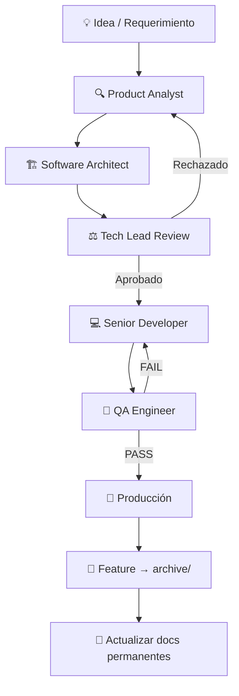

# 🤖 ai-agents — AI-Assisted Development Operating System

> Una biblioteca reutilizable de agentes, plantillas, workflows y checklists para desarrollo de software asistido por IA.  
> Diseñada para evolucionar. Construida para durar.

---

## 🎯 Objetivo

`ai-agents` es el **sistema operativo de desarrollo asistido por IA** para proyectos profesionales.

En lugar de improvisar prompts o depender de respuestas genéricas, este repositorio define:

- **Quién hace qué** (agentes especializados con roles claros)
- **Cómo se trabaja** (workflows reproducibles)
- **Qué se valida** (checklists por área)
- **Cómo se documenta** (templates estructurados)
- **Cómo se reutiliza** (entre proyectos, vía Git Submodules)

---

## 🧠 Filosofía de Trabajo

| Principio | Descripción |
|-----------|-------------|
| **Única Fuente de Verdad** | Los agentes viven en este repositorio, no en cada proyecto |
| **Roles Claros** | Cada agente tiene responsabilidades definidas y límites explícitos |
| **Flujo Estructurado** | El trabajo sigue un pipeline: Analyst ➡️ UI Designer ➡️ Architect ➡️ Tech Lead ➡️ Developer ➡️ QA |
| **Reutilización** | Templates y checklists son agnósticos al proyecto |
| **Evolución Gradual** | El repositorio crece con cada proyecto real |
| **Sin Duplicación** | Los proyectos referencian, no copian |
| **Actualización > Creación** | Un documento existente actualizado vale más que uno nuevo |

---

## 👥 Roles de los Agentes

| Agente | Archivo | Responsabilidad Principal |
|--------|---------|--------------------------| 
| **Skill Manager** | [`roles/skill-manager.md`](roles/skill-manager.md) | Orquestación, descubrimiento y resolución de skills (Pre-procesador) |
| **Product Analyst** | [`roles/analyst.md`](roles/analyst.md) | Transforma ideas en especificaciones funcionales claras |
| **UI Designer** | [`roles/ui-designer.md`](roles/ui-designer.md) | Diseña la interfaz visual, responsividad y accesibilidad (a11y) |
| **Software Architect** | [`roles/architect.md`](roles/architect.md) | Diseña soluciones técnicas escalables |
| **Tech Lead** | [`roles/tech-lead.md`](roles/tech-lead.md) | Supervisa, coordina y toma decisiones técnicas |
| **Senior Developer** | [`roles/developer.md`](roles/developer.md) | Implementa siguiendo la arquitectura aprobada |
| **QA Engineer** | [`roles/qa.md`](roles/qa.md) | Valida calidad antes de producción |
| **DevOps Engineer** | [`roles/devops.md`](roles/devops.md) | CI/CD, deployments, infraestructura *(bajo demanda)* |

### Restricciones por Diseño

Cada agente tiene **constraints explícitos** que definen lo que **NO** puede hacer. Esto evita que un agente invada el rol de otro, manteniendo separación de responsabilidades.

Cada agente también tiene una sección **Documentation Rules** que establece cuándo crear documentos, cuándo actualizar, y cómo identificar información permanente vs. temporal.

---

## 📁 Estructura de Carpetas

```
ai-agents/
│
├── roles/                    # Definiciones de agentes (v2.0)
│   ├── analyst.md             # Product Analyst
│   ├── ui-designer.md         # UI/UX Designer
│   ├── architect.md           # Software Architect
│   ├── tech-lead.md           # Tech Lead (supervisor y árbitro)
│   ├── developer.md           # Senior Developer
│   ├── qa.md                  # QA Engineer
│   ├── devops.md              # DevOps Engineer (especializado, bajo demanda)
│   ├── skill-manager.md       # Skill Manager (orquestador de contexto)
│   ├── prompt-guide.md        # Guía de prompts para usar los agentes
│   └── README.md
│
├── skills/                    # Skills metodológicas (Framework Skills)
│   ├── registry.md            # Reglas de descubrimiento y orquestación
│   └── ...                    # analysis/, architecture/, development/, etc.
│
├── templates/                 # Plantillas reutilizables
│   ├── ide-configs/           # 🆕 Configuraciones para IDEs de IA
│   │   ├── AGENTS.md          # Fuente de verdad: roles, workflows, reglas
│   │   ├── CLAUDE.md          # Instrucciones para Claude Code CLI
│   │   ├── cursorrules        # Reglas para Cursor IDE
│   │   ├── windsurfrules      # Reglas para Windsurf (Cascade)
│   │   ├── clinerules         # Reglas para Cline / Roo-Code
│   │   └── copilot-instructions.md  # Instrucciones para GitHub Copilot
│   ├── feature-spec.md        # Especificación funcional
│   ├── ui-design-spec.md      # Diseño visual de interfaz
│   ├── architecture-spec.md   # Diseño técnico
│   ├── technical-task.md      # Tarea para el Developer
│   ├── qa-report.md           # Reporte de QA
│   ├── bug-report.md          # Reporte de bug
│   ├── project-context.md     # Contexto del proyecto (.ai/context.md)
│   └── feature-folder-template.md  # Estructura de carpeta por feature
│
├── checklists/                # Checklists por área técnica
│   ├── frontend-review.md
│   ├── ui-review.md
│   ├── backend-review.md
│   └── database-review.md
│
├── workflows/                 # Flujos de trabajo para escenarios comunes
│   ├── new-feature.md         # Pipeline completo de nueva feature (Analyst ➡️ UI ➡️ Architect ➡️ TL ➡️ Dev ➡️ QA)
│   ├── bug-fix.md             # Proceso dinámico de corrección de bugs
│   ├── refactor.md            # Refactorización sin cambio de comportamiento
│   ├── release.md             # Proceso de deployment a producción
│   └── architecture-change.md # Cambios estructurales del sistema
│
├── scripts/                   # Scripts de automatización
│   ├── common.sh              # Utilidades y variables comunes (interno)
│   ├── setup-ide.sh           # Inicializador de estructura .ai/ y reglas de IDE
│   ├── new-initiative.sh      # Bootstrap automático de una feature o bug
│   └── validate-project.sh    # Validador de cumplimiento de estructura documental (R1-R5)
│
├── docs/                      # Documentación del repositorio
│   ├── agent-definitions.md   # Estándar de diseño de agentes
│   ├── repository-structure.md
│   ├── agent-lifecycle.md
│   ├── versioning-strategy.md
│   ├── project-integration.md
│   ├── roadmap.md
│   ├── documentation-strategy.md   # 📋 Estrategia documental del sistema
│   ├── naming-conventions.md       # 📋 Convenciones FEAT-001, BUG-001, ARCH-001
│   └── project-ai-structure.md     # 📋 Guía de la estructura .ai/ por proyecto
│
├── AGENTS.md                  # Guía de contribución a este repo
├── CHANGELOG.md               # Historial de cambios del repositorio
├── .gitignore
└── README.md
```

---

## 🧩 Sistema de Orquestación y Skills

El sistema ha evolucionado a un modelo de **Orquestación y Descubrimiento**. `ai-agents` no mantiene un repositorio gigante de tecnologías; en su lugar, el **Skill Manager** detecta, prioriza y ensambla dinámicamente las capacidades (skills) disponibles en:

1. **Project Skills:** Específicas del repositorio actual.
2. **User Installed Skills:** Herramientas y plugins externos (Gemini CLI, Claude Code, MCP Servers).
3. **Framework Skills:** Capacidades metodológicas (*cómo* diseñar APIs, revisar código) incluidas en este framework.

Estas skills se resuelven y entregan como contexto enriquecido a cada agente, garantizando que el diseño y la implementación respeten las reglas y herramientas reales del entorno. 

Documentación clave:
- [`docs/skill-discovery.md`](docs/skill-discovery.md)
- [`docs/skill-resolution.md`](docs/skill-resolution.md)
- [`docs/external-skill-providers.md`](docs/external-skill-providers.md)
- [`docs/skill-context.md`](docs/skill-context.md)

---

## 📂 Sistema Documental

### El problema que resuelve

Los agentes que generan documentos arbitrariamente producen: crecimiento descontrolado de archivos, duplicación de conocimiento, información obsoleta y ruido para la IA al consumir contexto.

### El modelo de dos niveles

**A. Conocimiento Permanente** — vive en `.ai/` en la raíz del proyecto:

```
.ai/
├── context.md          # Identidad del proyecto, stack, convenciones
├── business-rules.md   # Reglas de negocio permanentes del dominio
├── architecture.md     # Arquitectura actual del sistema (única versión vigente)
├── decisions.md        # Log de decisiones arquitectónicas (ARCH-NNN)
└── glossary.md         # Términos del dominio con definiciones acordadas
```

**B. Trabajo por Feature** — cada iniciativa en su propio espacio:

```
.ai/features/
├── FEAT-001-seat-layout/
│   ├── spec.md
│   ├── ui-design.md
│   ├── architecture.md
│   ├── qa.md
│   └── decision.md
└── FEAT-002-user-notifications/
    └── ...
```

### Las 5 Reglas Documentales

| Regla | Enunciado |
|-------|-----------|
| **R1** | Antes de crear un documento nuevo, verificar si existe uno equivalente que deba actualizarse |
| **R2** | Priorizar actualización sobre creación |
| **R3** | Nunca crear `architecture-v2.md`, `architecture-final.md` — actualizar el existente |
| **R4** | Las features son el único lugar donde pueden existir documentos de una iniciativa específica |
| **R5** | Los documentos raíz representan el estado actual del sistema, no una versión histórica |

Ver [`docs/documentation-strategy.md`](docs/documentation-strategy.md) para la guía completa.  
Ver [`docs/project-ai-structure.md`](docs/project-ai-structure.md) para la estructura `.ai/` detallada.

---

## 🔄 Flujo de Trabajo Recomendado



### Descripción del Flujo

1. **Analyst** — Clarifica el requerimiento, crea `.ai/features/FEAT-XXX/spec.md`
2. **Architect** — Diseña la solución, crea `.ai/features/FEAT-XXX/architecture.md`
3. **Tech Lead** — Revisa y aprueba
4. **Developer** — Implementa siguiendo la arquitectura aprobada
5. **QA** — Valida, crea `.ai/features/FEAT-XXX/qa.md`
6. **Producción** — Solo si QA emite PASS
7. **Cierre** — Feature a `archive/`, documentos permanentes actualizados si aplica

---

## 🏷️ Convenciones de Nomenclatura

| Tipo | Formato | Ejemplo |
|------|---------|---------|
| Feature | `FEAT-NNN-slug` | `FEAT-001-seat-layout` |
| Bug | `BUG-NNN-slug` | `BUG-023-double-booking` |
| ADR | `ARCH-NNN` | `ARCH-012` |
| Branch feature | `feat/NNN-slug` | `feat/001-seat-layout` |
| Branch fix | `fix/NNN-slug` | `fix/023-double-booking` |

Ver [`docs/naming-conventions.md`](docs/naming-conventions.md) para las convenciones completas.

---

## 🚀 Guía de Integración en tu Proyecto

Esta sección explica cómo integrar `ai-agents` en cualquier proyecto de desarrollo para que la IA de tu IDE pueda instanciar los agentes, seguir los workflows y respetar el sistema documental.

### Paso 1: Agregar como Git Submodule

```bash
# Desde la raíz de tu proyecto
git submodule add https://github.com/ezequielmendoza-dev/ai-agents.git .ai/agents
git commit -m "chore: add ai-agents as submodule in .ai/agents"
```

Esto crea la carpeta `.ai/agents/` con todo el contenido de este repositorio, y un archivo `.gitmodules` en la raíz de tu proyecto.

> **¿Ya clonaste un proyecto que lo tiene?** Ejecutá:
> ```bash
> git submodule update --init --recursive
> ```

### Paso 2: Ejecutar el Instalador

```bash
# Desde la raíz de tu proyecto
bash .ai/agents/scripts/setup-ide.sh
```

El script interactivo [`setup-ide.sh`](scripts/setup-ide.sh) te guiará a través de 3 pasos:

#### 2.1 — Inicialización de la estructura `.ai/`

Crea automáticamente la memoria del proyecto:

```
mi-proyecto/
└── .ai/
    ├── agents/              ← Git Submodule (este repositorio)
    ├── context.md           ← Identidad del proyecto (stack, módulos, convenciones)
    ├── business-rules.md    ← Reglas de negocio permanentes del dominio
    ├── architecture.md      ← Arquitectura actual del sistema en producción
    ├── decisions.md         ← Log de decisiones técnicas (ADRs)
    ├── glossary.md          ← Glosario del dominio
    ├── features/            ← Trabajo activo por feature (FEAT-NNN-slug/)
    ├── archive/             ← Features completadas (read-only)
    └── sessions/            ← Sesiones de trabajo locales (no se commitea)
```

#### 2.2 — Generación de archivos de configuración para IDEs

El script te pregunta qué IDEs usás y copia los archivos correspondientes a la raíz de tu proyecto:

| Opción | Archivo generado | IDE | Qué hace |
| :---: | :--- | :--- | :--- |
| 1 | `.cursorrules` | Cursor | Reglas para Composer, Chat y edición inline |
| 2 | `CLAUDE.md` | Claude Code CLI | Comandos del proyecto, reglas de terminal |
| 3 | `.windsurfrules` | Windsurf | Reglas para flujos de Cascade |
| 4 | `.clinerules` | Cline / Roo-Code | Control de costos, aprobación de acciones |
| 5 | `.github/copilot-instructions.md` | GitHub Copilot | Autocompletado, PR review |
| 6 | `AGENTS.md` | Todos | **Fuente de verdad**: roles, workflows, reglas, prompts |
| 7 | Todos los anteriores | — | Instala todo de una vez |

> **Arquitectura DRY:** `AGENTS.md` centraliza toda la información de roles, workflows, reglas documentales y prompts de activación. Los archivos específicos de cada IDE (`cursorrules`, `CLAUDE.md`, etc.) solo contienen instrucciones exclusivas de esa herramienta y referencian a `AGENTS.md` como fuente de verdad.

#### 2.3 — Configuración de `.gitignore`

Agrega automáticamente `.ai/sessions/` al `.gitignore` de tu proyecto para que las sesiones de trabajo locales no se commiteen.

### Paso 3: Completar el contexto del proyecto

Abrí `.ai/context.md` y completá la información técnica de tu proyecto. Este archivo es **la memoria del proyecto** — es lo primero que cualquier agente de IA leerá antes de actuar.

#### 💡 Autogeneración del Contexto por la IA (Recomendado)
Si ya tienes código en tu proyecto, en lugar de completarlo a mano, puedes pedirle a tu asistente de IA del IDE que lo autogenere analizando el codebase. 

Ejecuta este prompt en el Composer/Chat de tu IDE:
```markdown
Actúa como el agente Product Analyst definido en .ai/agents/roles/analyst.md y genera el archivo `.ai/context.md` de este proyecto basándote en la plantilla `.ai/agents/templates/project-context.md` tras escanear la estructura y archivos de configuración.
```

Las secciones mínimas obligatorias que generará son:

```markdown
## Nombre y tipo del proyecto
## Stack tecnológico (con versiones)
## Módulos existentes y su estado
## Convenciones del proyecto (naming, estructura)
## Decisiones técnicas importantes
## Restricciones conocidas
```

Ver [`templates/project-context.md`](templates/project-context.md) como referencia de la plantilla.

### Paso 4: Empezar a trabajar con la IA

Una vez configurado, tu IDE de IA puede:

1. **Leer la memoria del proyecto** — `.ai/context.md`, `.ai/architecture.md`, `.ai/business-rules.md`
2. **Asumir roles especializados** — leyendo los archivos de `.ai/agents/roles/`
3. **Seguir los workflows** — según el tipo de tarea (`new-feature`, `bug-fix`, `refactor`, etc.)
4. **Usar templates y checklists** — para crear documentos y validar calidad

Para ejemplos de prompts de activación de agentes, ver la sección "Cómo Instanciar un Agente" en `AGENTS.md` o la guía detallada en [`roles/prompt-guide.md`](roles/prompt-guide.md).

### Resultado Final

Después del setup, tu proyecto tendrá esta estructura:

```
mi-proyecto/
├── src/                     # Tu código
├── .ai/
│   ├── agents/              # ← Submódulo ai-agents (este repo)
│   ├── context.md           # ← Completado por vos
│   ├── business-rules.md
│   ├── architecture.md
│   ├── decisions.md
│   ├── glossary.md
│   └── features/
│       └── FEAT-001-slug/   # ← Trabajo activo
├── AGENTS.md                # ← Guía de agentes para la IA
├── .cursorrules             # ← Reglas de Cursor (o el IDE que elijas)
├── CLAUDE.md                # ← Reglas de Claude Code
└── .gitignore               # ← Actualizado con .ai/sessions/
```

### Mantener los Agentes Actualizados

```bash
# Actualizar al último commit de ai-agents
git submodule update --remote .ai/agents
git add .ai/agents
git commit -m "chore: update ai-agents submodule to latest"

# Pinear a una versión específica (recomendado para producción)
cd .ai/agents && git checkout v2.0.0 && cd ../..
git add .ai/agents
git commit -m "chore: pin ai-agents to v2.0.0"
```

Ver [`docs/project-integration.md`](docs/project-integration.md) para troubleshooting y estrategias de actualización por tipo de proyecto.

---

## ⚙️ Scripts de Automatización

El repositorio cuenta con scripts en bash (`scripts/`) para facilitar la configuración, mantenimiento y apego a la metodología de `ai-agents OS` de forma rápida y sin errores.

### 🛠️ `scripts/setup-ide.sh`
**Propósito:** Inicializar el entorno del proyecto consumidor.
- **Paso 1:** Pregunta si se desea crear la estructura documental `.ai/` (`features/`, `archive/`, `sessions/`) y copia las plantillas permanentes iniciales (`context.md`, `business-rules.md`, `architecture.md`, `decisions.md`, `glossary.md`).
- **Paso 2:** Genera las configuraciones específicas del IDE (`.cursorrules`, `CLAUDE.md`, `.windsurfrules`, `.clinerules`, `.github/copilot-instructions.md`, y la guía global `AGENTS.md`) de forma modular (DRY).
- **Paso 3:** Configura el `.gitignore` del proyecto para ignorar las sesiones locales en `.ai/sessions/`.
- **Uso:**
  ```bash
  bash .ai/agents/scripts/setup-ide.sh
  ```

### 🚀 `scripts/new-initiative.sh`
**Propósito:** Automatizar la creación de una nueva iniciativa (Feature o Bug) respetando las convenciones.
- **Modo interactivo:** Si se ejecuta sin argumentos, te guía preguntándote el tipo de iniciativa, lee `.ai/context.md` para sugerir automáticamente el siguiente ID numérico disponible (ej: si el último fue `FEAT-002`, sugiere `003`), y valida el slug en `kebab-case`.
- **Modo directo (Argumentos):**
  ```bash
  bash .ai/agents/scripts/new-initiative.sh <FEAT|BUG> <ID> <slug>
  ```
  *Ejemplo:* `bash .ai/agents/scripts/new-initiative.sh FEAT 003 login-seguro`
- **Archivos creados:**
  - Para `FEAT`: Genera `spec.md`, `ui-design.md`, `architecture.md`, `qa.md` y `decision.md`.
  - Para `BUG`: Genera `bug-report.md` y `qa.md`.
- **Actualización:** Reemplaza los placeholders `FEAT-XXX` / `BUG-XXX` y actualiza automáticamente el registro de IDs en `.ai/context.md`.

### 🔍 `scripts/validate-project.sh`
**Propósito:** Validar el cumplimiento de la estructura de `ai-agents OS` (ideal para pipelines de CI/CD).
- Escanea la carpeta `.ai/` buscando archivos obligatorios vacíos o faltantes.
- Comprueba que las carpetas de iniciativas en `features/` y `archive/` cumplan estrictamente el formato de nomenclatura `(FEAT|BUG)-NNN-slug`.
- Verifica que las carpetas de iniciativas contengan todos los archivos mandatorios.
- Retorna un código de salida `0` si todo está en orden, o `1` si hay violaciones críticas de cumplimiento documental.
- **Uso:**
  ```bash
  bash .ai/agents/scripts/validate-project.sh
  ```

### 📦 `scripts/common.sh`
**Propósito:** Librería compartida interna (DRY).
- Centraliza la definición de colores de salida para consola.
- Resuelve rutas base globales (`AI_AGENTS_ROOT`, `CWD`).
- Contiene la función lógica `detect_project_root` para ubicar la carpeta del proyecto en cualquier escenario (directo, submódulo, ejecución anidada).

---

## 🧪 Ejemplos de Uso

> [!NOTE]
> Gracias a las reglas del IDE (`.cursorrules`, `CLAUDE.md`, etc.), la IA lee de forma autónoma la memoria de `.ai/context.md` al ser invocada. Por lo tanto, **no necesitas pegar ni pasar el contexto del proyecto en ningún prompt**.

### Crear una nueva feature

```markdown
# Paso 1: Crear la estructura de la feature
# (Puedes usar el asistente o el script `new-initiative.sh`)
mkdir -p .ai/features/FEAT-001-nombre
touch .ai/features/FEAT-001-nombre/spec.md
touch .ai/features/FEAT-001-nombre/ui-design.md

# Paso 2: Activar Analyst
Actúa como el agente Product Analyst definido en .ai/agents/roles/analyst.md.
Nuestra feature actual es: FEAT-001-nombre
Requerimiento: [descripción del requerimiento o idea de negocio]

# Paso 3: Activar UI Designer
Actúa como el agente UI Designer definido en .ai/agents/roles/ui-designer.md.
Nuestra feature actual es: FEAT-001-nombre
Genera el diseño visual en .ai/features/FEAT-001-nombre/ui-design.md basándote en la spec.md.
```

### Reportar un bug

```markdown
# Activar QA para documentar el bug
Actúa como el agente QA Engineer definido en .ai/agents/roles/qa.md.
Nuestra feature actual es: BUG-001-nombre-bug
Escribe el reporte de bug en .ai/features/BUG-001-nombre-bug/bug-report.md basándote en: [descripción del fallo]
```

### Revisar código o diseño

```markdown
# Activar Tech Lead
Actúa como el agente Tech Lead definido en .ai/agents/roles/tech-lead.md.
Nuestra feature actual es: FEAT-001-nombre
Por favor, revisa el archivo de diseño (.ai/features/FEAT-001-nombre/architecture.md) y de especificación (.ai/features/FEAT-001-nombre/spec.md).
```

---

## 🚀 Integración Futura con MCP

Este repositorio está diseñado para evolucionar hacia un **MCP Server propio** que exponga los agentes como herramientas accesibles desde cualquier IDE o sistema multiagente.

Ver [`docs/roadmap.md`](docs/roadmap.md) para el plan evolutivo completo.

---

## ✅ Buenas Prácticas

- **Siempre empieza con el Analyst** — evita implementar sin especificaciones claras
- **El Tech Lead es el árbitro** — si hay conflicto entre Analyst y Architect, el Tech Lead decide
- **Completa los checklists** — no son opcionales antes de un release
- **Actualiza, no dupliques** — si el documento existe, actualizarlo es la respuesta correcta
- **Documenta los ejemplos** — cada feature real es un ejemplo potencial para el repositorio
- **Versiona los cambios a agentes** — usa tags de Git para marcar versiones estables
- **Mantén `.ai/context.md` actualizado** — es la memoria compartida del proyecto
- **Archiva las features completadas** — mueve `FEAT-XXX/` a `archive/` después de cada release

---

## 📌 Versión Actual

| Campo | Valor |
|-------|-------|
| Versión | `v1.6.6` |
| Estado | Estable |
| Última actualización | Junio 2026 |

---

*Construido para pensar en grande, empezar en pequeño y escalar sin límites.*
