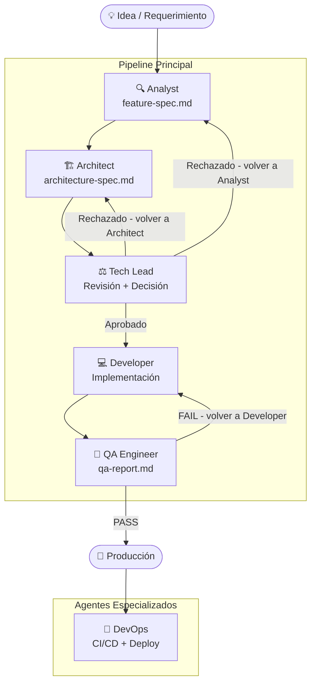

# Ciclo de Vida de un Agente

> Cómo se diseña, usa, mejora y versiona un agente en este repositorio.

---

## 1. El Pipeline de Agentes

Los agentes están diseñados para trabajar **en secuencia**, no de forma aislada. Cada agente produce un artefacto que es el input del siguiente.



---

## 2. Estados de un Agente en una Sesión

Durante una sesión de trabajo, un agente puede estar en estos estados:

| Estado | Descripción | Qué hacer |
|--------|-------------|-----------|
| **Inactivo** | No está activado | Activar con el prompt correspondiente |
| **Activo** | Procesando inputs | Esperar su output |
| **Bloqueado** | Le falta información para continuar | Proveer la información faltante o escalar |
| **Completado** | Produjo su output | Pasar el output al siguiente agente |
| **Rechazado** | Su output fue rechazado por el Tech Lead | Revisar el feedback y reactivar |

---

## 3. Ciclo de Vida de un Agente en el Repositorio

### Fase 1: Creación

Un agente se crea cuando:
- Se identifica un rol que ningún agente existente cubre
- Un rol existente se ha vuelto demasiado amplio y necesita dividirse
- Se necesita especialización en un área técnica nueva

**Proceso:**
1. Definir el rol, misión y responsabilidades
2. Definir los constraints (tan importante como las responsabilidades)
3. Diseñar el Chain of Thought
4. Diseñar el Output Format con ejemplos reales
5. Escribir la guía de activación
6. Agregarlo al `agents/README.md`
7. Documentar el ejemplo de uso en `agents/prompt-guide.md`

### Fase 2: Uso

El agente se usa en proyectos reales a través de prompts. Durante el uso se recopila feedback:
- ¿El output es útil y accionable?
- ¿Los constraints están bien definidos?
- ¿El Chain of Thought guía correctamente?
- ¿El Output Format facilita el trabajo del siguiente agente?

### Fase 3: Mejora

Cuando el feedback acumulado justifica una mejora:

| Tipo de cambio | Versión resultante |
|---------------|-------------------|
| Fix de un error en constraints o instrucciones | `X.Y` → `X.Y+1` (patch) |
| Nueva sección o mejora significativa al output | `X.Y` → `X+1.0` (minor) |
| Rediseño completo del agente | `X.Y` → nueva versión major |

### Fase 4: Deprecación

Un agente se depreca cuando:
- Su rol es cubierto por otro agente
- Se divide en dos agentes más especializados
- El flujo de trabajo cambió y ya no es necesario

**Proceso de deprecación:**
1. Agregar aviso en el encabezado del archivo
2. Documentar el agente que lo reemplaza
3. Actualizar `CHANGELOG.md`
4. Eliminar en la siguiente versión major

---

## 4. Guía para Crear un Nuevo Agente

Si necesitas un agente nuevo, usa esta estructura base:

```markdown
# [Nombre del Agente]

> **Versión:** 1.0
> **Rol en el pipeline:** [posición y relación con otros agentes]
> **Agente anterior:** [quién viene antes]
> **Siguiente agente:** [quién viene después]

## Role
[Quién es — experiencia, perspectiva, especialidad]

## Mission
[Qué debe lograr — los atributos de calidad de su output]

## Responsibilities
[Qué hace — organizado en categorías con bullet points]

## Constraints
[Qué NO hace — con ❌ para prohibiciones y ✅ para excepciones]

## Inputs
[Qué información puede recibir]

## Chain of Thought
[6-8 preguntas que el agente debe procesar internamente antes de responder]

## Output Format
[Estructura exacta de la respuesta con ejemplos reales]

## Cómo Activar Este Agente
[Prompt de activación + señales de cuándo usar/no usar]
```

---

## 5. Métricas de Calidad de un Agente

Un agente está bien diseñado si cumple estos criterios:

| Criterio | Cómo verificarlo |
|----------|-----------------|
| **Rol claro** | ¿Se puede describir en una oración? |
| **Constraints precisos** | ¿Hay situaciones ambiguas sobre qué puede o no hacer? |
| **Output predecible** | ¿Dos ejecuciones del mismo input producen outputs estructuralmente similares? |
| **Accionable** | ¿El output del agente puede ser usado directamente por el siguiente agente sin interpretación? |
| **Sin solapamiento** | ¿El agente hace algo que ningún otro agente ya hace? |
| **Activación clara** | ¿Está claro cuándo usar este agente y cuándo no? |

---

*Documentación versión 1.0 — ai-agents library | [github.com/ezequielmendoza-dev/ai-agents](https://github.com/ezequielmendoza-dev/ai-agents)*
