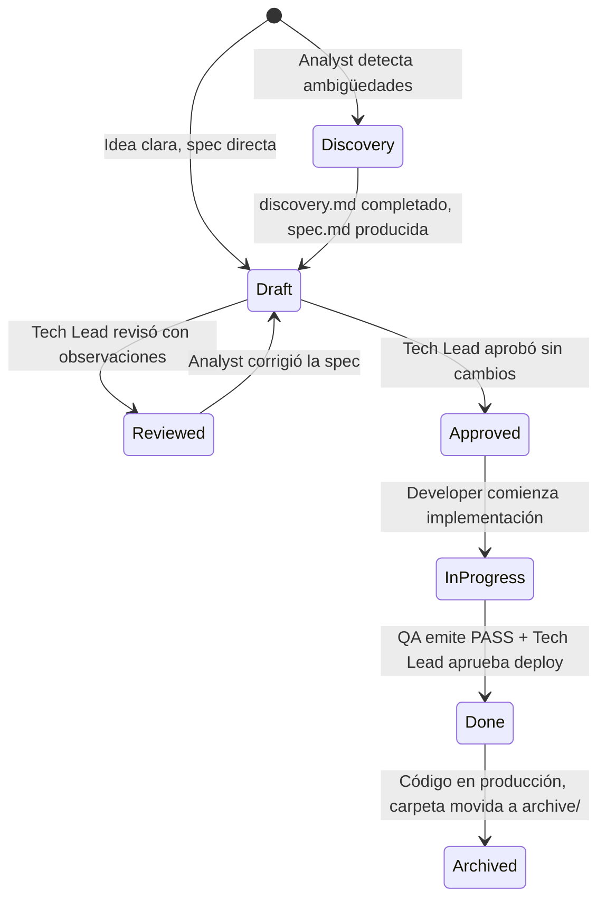

# Ciclo de Vida de los Artefactos

> **Versión:** 1.0  
> **Estado:** Vigente  
> **Última actualización:** Julio 2026

---

## Propósito

Este documento define el ciclo de vida formal de los artefactos producidos por el framework `ai-agents`. Un artefacto es cualquier documento generado durante el desarrollo de una feature que capture conocimiento verificable.

El ciclo de vida responde a la pregunta: *¿en qué estado está este documento y quién puede hacer qué con él?*

---

## Estados de una Feature

```
Discovery → Draft → Reviewed → Approved → In Progress → Done → Archived
```

| Estado | Descripción | Quién lo asigna | Artefactos activos |
|--------|-------------|-----------------|-------------------|
| `Discovery` | La idea está siendo explorada. Hay ambigüedades sin resolver | Analyst | `discovery.md` |
| `Draft` | `spec.md` generada. Pendiente de revisión del Tech Lead | Analyst | `spec.md`, `discovery.md` (si existe) |
| `Reviewed` | Tech Lead revisó con observaciones. Analyst debe corregir | Tech Lead | `spec.md` (en edición) |
| `Approved` | Spec y diseños aprobados. Listo para implementar | Tech Lead | `spec.md`, `ui-design.md`, `architecture.md` |
| `In Progress` | Developer implementando activamente | Developer | Código |
| `Done` | QA emitió PASS y Tech Lead aprobó el deploy | Tech Lead | `qa.md` |
| `Archived` | Feature en producción. Carpeta movida a `archive/` | — | Todos (read-only) |

El estado de la feature se registra en el campo `Estado` del metadata de `spec.md`.

---

## Ciclo de Vida por Artefacto

### `discovery.md`

```
CREADO      → Cuando el Analyst detecta ambigüedades críticas antes de la spec
ACTIVO      → Durante la sesión de discovery (preguntas, respuestas, decisiones)
COMPLETADO  → Cuando la spec.md es producida a partir de él
ARCHIVADO   → Junto con la feature al moverla a archive/
```

**Quién lo crea:** Product Analyst  
**Quién lo lee:** Analyst (para producir spec), Tech Lead (referencia, no aprobación)  
**Quién lo aprueba:** Nadie — es un artefacto de trabajo interno del Analyst  
**Regla:** Nunca reemplaza a `spec.md`. Es un antecedente, no un sustituto.

---

### `spec.md`

```
DRAFT       → Analyst lo produjo. Pendiente de revisión del Tech Lead
IN REVIEW   → Tech Lead lo está revisando
REVIEWED    → Tech Lead emitió observaciones. Analyst debe corregir
APPROVED    → Tech Lead aprobó. Ningún agente puede modificarlo sin aprobación
SUPERSEDED  → Una nueva versión de la spec reemplazó esta (se actualiza en el lugar)
```

**Quién lo crea:** Product Analyst  
**Quién lo aprueba:** Tech Lead  
**Quién lo lee:** UI Designer, Architect, QA, Developer (para validación)  
**Regla:** Nunca crear `spec-v2.md`. Actualizar `spec.md` y cambiar el campo `Versión`.

---

### `ui-design.md`

```
DRAFT       → UI Designer lo produjo. Pendiente de revisión del Tech Lead
REVIEWED    → Tech Lead emitió observaciones visuales
APPROVED    → Tech Lead aprobó
```

**Quién lo crea:** UI Designer  
**Precondición:** `spec.md` en estado `Approved`  
**Quién lo aprueba:** Tech Lead  
**Quién lo lee:** Architect (para alinear diseño técnico), Developer (para implementar UI)

---

### `architecture.md`

```
DRAFT       → Architect lo produjo. Pendiente de revisión del Tech Lead
REVIEWED    → Tech Lead emitió observaciones técnicas
APPROVED    → Tech Lead aprobó. Developer puede comenzar a implementar
```

**Quién lo crea:** Software Architect  
**Precondición:** `spec.md` en estado `Approved`  
**Quién lo aprueba:** Tech Lead  
**Quién lo lee:** Developer, QA

---

### `qa.md`

```
OPEN        → QA comenzó la validación
PASS        → Sin bugs críticos. Feature puede ir a producción
PASS WITH OBSERVATIONS → Bugs menores. Tech Lead decide si bloquea o no
FAIL        → Bugs críticos. Developer debe corregir antes de continuar
```

**Quién lo crea:** QA Engineer  
**Precondición:** Implementación completa del Developer  
**Quién lo aprueba:** Tech Lead (veredicto final de deployment)

---

### `decision.md`

```
ACTIVO      → Decisión registrada y vigente para esta feature
ARCHIVADO   → Junto con la feature. Si la decisión impacta el sistema global,
              se registra también en .ai/decisions.md antes de archivar
```

**Quién lo crea:** Tech Lead o Architect  
**Quién lo lee:** Cualquier agente que necesite entender por qué algo se diseñó de cierta manera

---

## Transiciones de Estado Válidas



---

## Documentos Permanentes (`.ai/`)

Los documentos en `.ai/` tienen un ciclo de vida diferente: **no tienen estados de feature**, porque representan el sistema en producción en todo momento.

| Documento | Estado válido | Acción si está desactualizado |
|-----------|--------------|-------------------------------|
| `context.md` | Siempre vigente | Actualizar inmediatamente |
| `business-rules.md` | Siempre vigente | Actualizar inmediatamente |
| `architecture.md` | Siempre vigente | Actualizar después de cada release |
| `decisions.md` | Append-only | Agregar nueva entrada, nunca eliminar |
| `glossary.md` | Siempre vigente | Actualizar cuando aparece un término nuevo |

**Regla crítica:** Un documento permanente desactualizado no es un documento histórico — es un documento incorrecto. Debe corregirse antes de continuar trabajando.

---

## Lecturas Relacionadas

- [`docs/sdd-philosophy.md`](sdd-philosophy.md) — Fundamentos del modelo SDD
- [`docs/documentation-strategy.md`](documentation-strategy.md) — Las 5 Reglas Documentales
- [`templates/feature-folder-template.md`](../templates/feature-folder-template.md) — Estructura y contenido de cada artefacto

---

*Ciclo de Vida de Artefactos v1.0 — ai-agents framework | github.com/ezequielmendoza-dev/ai-agents*
