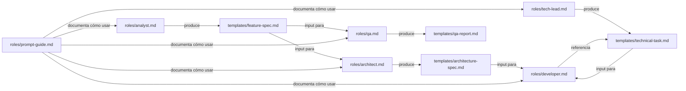

# Estructura del Repositorio

> Referencia completa de la organización de `ai-agents` y el propósito de cada carpeta y archivo.

---

## Árbol completo

```
ai-agents/
│
├── roles/                        # Agentes del sistema (fuente canónica)
│   ├── analyst.md                 # Product Analyst v2.0
│   ├── architect.md               # Software Architect v2.0
│   ├── tech-lead.md               # Tech Lead v2.0
│   ├── developer.md               # Senior Developer v2.0
│   ├── qa.md                      # QA Engineer v2.0
│   ├── devops.md                  # DevOps Engineer v1.0 (especializado)
│   ├── prompt-guide.md            # Guía de prompts por agente
│   └── README.md                  # Índice de agentes y pipeline visual
│
├── templates/                     # Plantillas de documentos de trabajo
│   ├── feature-spec.md            # Especificación funcional (output del Analyst)
│   ├── architecture-spec.md       # Diseño técnico (output del Architect)
│   ├── technical-task.md          # Tarea para el Developer (output del Tech Lead)
│   ├── qa-report.md               # Reporte de QA (output del QA Engineer)
│   ├── bug-report.md              # Reporte de bug (cualquier agente)
│   └── project-context.md         # Contexto del proyecto (.ai/context.md)
│
├── checklists/                    # Checklists de revisión por área
│   ├── frontend-review.md         # Revisión de código frontend
│   ├── backend-review.md          # Revisión de código backend
│   ├── database-review.md         # Revisión de schema y migraciones
│   ├── security-review.md         # Revisión de seguridad
│   ├── performance-review.md      # Revisión de rendimiento
│   └── release-review.md          # Checklist pre-release
│
├── workflows/                     # Flujos de trabajo documentados
│   ├── new-feature.md             # Pipeline completo para nueva feature
│   ├── bug-fix.md                 # Flujo de corrección de bugs
│   ├── refactor.md                # Flujo de refactoring
│   ├── release.md                 # Proceso de release a producción
│   └── architecture-change.md    # Cambios de arquitectura
│
├── examples/                      # Ejemplos reales como referencia
│   ├── logistics-seat-booking/
│   │   ├── analyst-output.md
│   │   ├── architect-output.md
│   │   ├── tech-lead-output.md
│   │   ├── developer-output.md
│   │   └── qa-output.md
│   ├── logistics-trip-management/
│   ├── gym-memberships/
│   └── ai-content-generator/
│
├── docs/                          # Documentación del repositorio
│   ├── agent-definitions.md       # Estándar de diseño de agentes
│   ├── repository-structure.md    # Este archivo
│   ├── agent-lifecycle.md         # Ciclo de vida de un agente
│   ├── versioning-strategy.md     # Estrategia de versionado
│   ├── project-integration.md     # Cómo integrar en proyectos
│   └── roadmap.md                 # Hoja de ruta evolutiva
│
├── .gitignore                     # Archivos ignorados por Git
├── CHANGELOG.md                   # Historial de versiones
└── README.md                      # Punto de entrada del repositorio
```

---

## Propósito de cada sección

### `roles/` — El núcleo

Contiene las definiciones de los agentes. Es la sección más importante del repositorio. Cada agente define:
- Su rol y experiencia
- Lo que hace y lo que **no** hace
- Cómo razona antes de responder (Chain of Thought)
- El formato exacto de su output
- Cómo activarlo con un prompt

**Regla:** Ningún agente vive fuera de `roles/`. La raíz del repositorio es solo para archivos de configuración del repo.

---

### `templates/` — Contratos de trabajo

Los templates definen la estructura de los documentos que producen los agentes. Son los **contratos** entre agentes:

```
Analyst produce → feature-spec.md
Architect consume feature-spec.md → produce architecture-spec.md
Tech Lead consume ambos → produce technical-task.md
Developer consume technical-task.md → produce código
QA consume feature-spec.md + código → produce qa-report.md
```

**Regla:** Cada template debe ser completamente independiente del stack tecnológico. Deben ser reutilizables en cualquier proyecto.

---

### `checklists/` — Validación estructurada

Los checklists son herramientas de revisión que garantizan que nada crítico se omite antes de aprobar un PR o hacer un release. Los usa principalmente el **QA Engineer** y el **Tech Lead**.

**Regla:** Los checklists deben ser prácticos y directos. Cada ítem debe ser verificable con un sí/no.

---

### `workflows/` — Procesos reproducibles

Los workflows documentan el flujo completo de trabajo para escenarios comunes. Incluyen diagramas Mermaid, los agentes involucrados y los artefactos que se producen.

**Regla:** Un workflow debe poder seguirse sin conocimiento previo del repositorio. Debe ser autocontenido.

---

### `examples/` — Referencia real

Los ejemplos son outputs reales (o realistas) de los agentes para features completas. Sirven como:
- Referencia de calidad para los outputs esperados
- Material de entrenamiento para nuevos usuarios del sistema
- Validación de que los agentes producen outputs útiles y consistentes

**Regla:** Los ejemplos deben ser lo suficientemente realistas para ser usados como referencia en un proyecto real.

---

### `docs/` — Conocimiento del repositorio

Documentación sobre el repositorio en sí — cómo funciona, cómo evoluciona, cómo integrarlo.

**Regla:** La documentación de `docs/` es sobre `ai-agents` como sistema. La documentación de proyectos específicos va en `.ai/context.md` dentro de cada proyecto.

---

## Convenciones de nomenclatura

| Tipo | Formato | Ejemplo |
|------|---------|---------|
| Archivos | `kebab-case.md` | `feature-spec.md` |
| Carpetas | `kebab-case/` | `logistics-seat-booking/` |
| IDs de features | `FEAT-XXX` | `FEAT-015` |
| IDs de bugs | `BUG-XXX` | `BUG-003` |
| IDs de QA reports | `QA-XXX` | `QA-008` |
| IDs de tasks | `TASK-XXX` | `TASK-021` |
| Versiones de agentes | `X.Y` | `2.0` |
| Tags de Git | `vX.Y.Z` | `v2.1.0` |

---

## Relación entre archivos



---

*Documentación versión 1.0 — ai-agents library | [github.com/ezequielmendoza-dev/ai-agents](https://github.com/ezequielmendoza-dev/ai-agents)*
