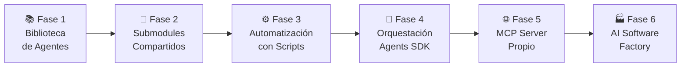

# Roadmap — Evolución de ai-agents

> Plan de evolución del repositorio en fases progresivas.  
> Cada fase construye sobre la anterior y puede tardar semanas, meses o años.  
> El objetivo final es una **AI Software Factory** personal basada en Specification-Driven Development (SDD).

---

## Visión General



---

## Fase 1 — Biblioteca de Agentes ✅ *En curso*

**Objetivo:** Tener una fuente única y estructurada de agentes, templates, checklists y workflows reutilizables entre proyectos.

**Estado:** Completado el núcleo inicial.

### Entregables de esta fase

- [x] 5 agentes del pipeline principal (Analyst, Architect, Tech Lead, Developer, QA)
- [x] 1 agente especializado (DevOps)
- [x] 6 templates de documentos de trabajo
- [x] 3 checklists de revisión técnica
- [ ] 3 checklists restantes (security, performance, release)
- [ ] 5 workflows documentados con diagramas Mermaid
- [ ] 4 ejemplos completos de uso real
- [ ] Documentación completa en `docs/`

### Criterios de completitud

- Los 6 agentes están completamente documentados y probados en proyectos reales
- Los workflows cubren los 5 escenarios más comunes
- Hay al menos 2 ejemplos completos que sirven como referencia

---

## Fase 2 — Submodules Compartidos 🔜 *Próxima*

**Objetivo:** Integrar `ai-agents` en todos los proyectos activos como submodule, garantizando que cualquier mejora a un agente se propaga a todos los proyectos con un solo comando.

### Tareas

- [ ] Integrar en proyecto LogiTrack
- [ ] Integrar en proyecto ControlFit
- [ ] Integrar en automatizaciones personales
- [ ] Crear `context/global-context.md` con convenciones globales
- [ ] Crear `context/logistics-domain.md` con reglas de dominio de logística
- [ ] Crear `context/fitness-domain.md` con reglas de dominio de fitness
- [ ] Documentar el proceso de actualización de submodule en cada proyecto

### Resultado esperado

Cada proyecto tiene una carpeta `.ai/` con:
```
.ai/
├── agents/        ← submodule de ai-agents (actualizable)
└── context.md     ← contexto específico del proyecto
```

---

## Fase 3 — Automatización con Scripts ⏳ *Mediano plazo*

**Objetivo:** Scripts que automatizan tareas repetitivas de gestión de agentes y contexto, para reducir la fricción al usar el sistema.

### Scripts planificados

```
ai-agents/
└── scripts/
    ├── init-project.sh          # Setup de .ai/ en un nuevo proyecto
    ├── update-all-projects.sh   # Actualizar submodule en todos los proyectos registrados
    ├── new-agent.sh             # Scaffold de nuevo agente desde template
    ├── validate-agents.sh       # Verificar que todos los agentes cumplen el estándar
    └── generate-context.sh      # Generar context.md inicial con preguntas interactivas
```

### Ejemplo: `init-project.sh`

```bash
#!/bin/bash
# Uso: ./scripts/init-project.sh /ruta/al/proyecto

PROJECT_PATH=$1
echo "🤖 Inicializando ai-agents en $PROJECT_PATH..."

mkdir -p "$PROJECT_PATH/.ai"
cd "$PROJECT_PATH"

git submodule add https://github.com/ezequielmendoza-dev/ai-agents.git .ai/agents
cp .ai/agents/templates/project-context.md .ai/context.md

echo "✅ Listo. Completa .ai/context.md con el contexto del proyecto."
```

---

## Fase 4 — Orquestación con Agents SDK ⏳ *Largo plazo*

**Objetivo:** Los agentes dejan de ser solo prompts de texto para convertirse en **agentes autónomos** que se encadenan automáticamente usando el OpenAI Agents SDK o Google Antigravity SDK.

### Concepto

```python
# Ejemplo conceptual con OpenAI Agents SDK
from agents import Agent, Runner

analyst = Agent(
    name="Product Analyst",
    instructions=open("roles/analyst.md").read(),
    tools=[read_context, ask_clarification]
)

architect = Agent(
    name="Software Architect",
    instructions=open("roles/architect.md").read(),
    tools=[read_context, read_feature_spec]
)

tech_lead = Agent(
    name="Tech Lead",
    instructions=open("roles/tech-lead.md").read(),
    tools=[read_all_artifacts, approve, reject, redirect]
)

# Pipeline automático
pipeline = Runner([analyst, architect, tech_lead])
pipeline.run("Quiero una feature de reserva de asientos para LogiTrack")
```

### Cambios necesarios en el repositorio para esta fase

- Agregar `roles/tools/` con definiciones de herramientas disponibles por agente
- Agregar `roles/pipelines/` con definiciones de orquestaciones predefinidas
- Los Output Formats deben ser parseables (JSON schemas además de Markdown)

---

## Fase 5 — MCP Server Propio ⏳ *Largo plazo*

**Objetivo:** Exponer los agentes como un **MCP (Model Context Protocol) Server** propio, haciendo que los agentes estén disponibles como herramientas nativas en cualquier IDE compatible (Cursor, Claude, etc.).

### Concepto

```json
// mcp-server/manifest.json
{
  "name": "ai-agents",
  "version": "1.0.0",
  "description": "AI development agents for software engineering",
  "tools": [
    {
      "name": "analyst",
      "description": "Product Analyst — analyze requirements and produce functional specs",
      "inputSchema": { "requirement": "string", "projectContext": "string" }
    },
    {
      "name": "architect",
      "description": "Software Architect — design technical solutions from functional specs",
      "inputSchema": { "featureSpec": "string", "projectContext": "string" }
    }
  ]
}
```

### Uso desde un IDE con MCP

```
# En Cursor, con el MCP server corriendo:
@ai-agents analyst "Necesito un sistema de reservas para LogiTrack"
@ai-agents architect [output del analyst anterior]
@ai-agents tech-lead [revisar ambos outputs]
```

### Infraestructura necesaria

```
ai-agents/
└── mcp-server/
    ├── server.ts           # MCP Server implementation
    ├── tools/
    │   ├── analyst.ts      # Tool wrapper para el agente
    │   ├── architect.ts
    │   └── ...
    └── package.json
```

---

## Fase 6 — AI Software Factory 🏭 *Visión a largo plazo*

**Objetivo:** Un sistema completamente orquestado donde, dado un requerimiento de negocio, el sistema produce automáticamente la especificación funcional, el diseño técnico, las tareas de desarrollo y los casos de prueba, con mínima intervención humana.

### Visión

```
[Requerimiento de negocio]
         ↓
   [Analyst Agent]        → feature-spec.md (automático)
         ↓
  [Architect Agent]       → architecture-spec.md (automático)
         ↓
  [Tech Lead Agent]       → validación + tasks (automático)
         ↓
  [Developer Agent]       → código real en el repo (automático)
         ↓
   [QA Agent]             → test suite (automático)
         ↓
  [DevOps Agent]          → PR + deployment (automático)
         ↓
   [Humano revisa]        → aprueba o rechaza
```

### Lo que hace único este enfoque

- **No es un producto SaaS** — es tu sistema operativo personal de desarrollo
- **Mejora con cada proyecto** — los ejemplos alimentan a los agentes
- **Adaptado a tu stack** — no genérico, sino específico a tus convenciones
- **Evoluciona contigo** — el repositorio crece con tu conocimiento

---

## Timeline Estimado

| Fase | Estimación | Estado |
|------|------------|--------|
| Fase 1 — Biblioteca | Q1-Q2 2026 | 🔄 En curso |
| Fase 2 — Submodules | Q3 2026 | 📋 Planificado |
| Fase 3 — Scripts | Q4 2026 | 📋 Planificado |
| Fase 4 — Agents SDK | Q1-Q2 2027 | 💭 Conceptual |
| Fase 5 — MCP Server | Q3 2027 | 💭 Conceptual |
| Fase 6 — AI Factory | 2028+ | 🌟 Visión |

---

*Roadmap versión 2.0 — ai-agents framework | [github.com/ezequielmendoza-dev/ai-agents](https://github.com/ezequielmendoza-dev/ai-agents)*
