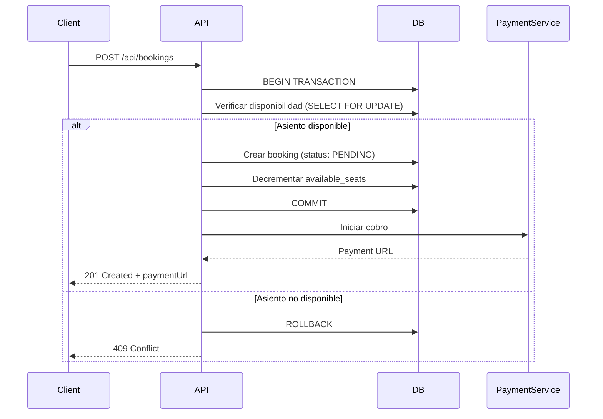

# Architecture Specification Template

> **Uso:** Completar después de tener una Feature Spec aprobada.  
> **Responsable:** Software Architect  
> **Revisado por:** Tech Lead

---

## Metadata

| Campo | Valor |
|-------|-------|
| **Proyecto** | `[nombre-del-proyecto]` |
| **Feature ID** | `FEAT-XXX` |
| **Arch Spec ID** | `ARCH-XXX` |
| **Fecha** | `YYYY-MM-DD` |
| **Versión** | `1.0` |
| **Estado** | `Draft / In Review / Approved` |
| **Arquitecto** | `[nombre]` |
| **Referencia Funcional** | `[link a feature-spec]` |

---

## 1. Resumen Técnico

> Descripción general de la solución técnica propuesta en 3-5 líneas.

**Ejemplo:**
> Se agrega un módulo de reservas sobre la arquitectura existente. Se introduce la entidad `Booking` con estados propios, se exponen dos nuevos endpoints REST y se integra el procesador de pagos existente. La disponibilidad de asientos se maneja con un campo `availableSeats` en `Trip` actualizado mediante transacciones atómicas.

---

## 2. Stack Tecnológico

| Capa | Tecnología | Justificación |
|------|-----------|---------------|
| Backend | `[ej: Node.js + Express]` | `[razón]` |
| Base de Datos | `[ej: PostgreSQL]` | `[razón]` |
| Frontend | `[ej: React + TypeScript]` | `[razón]` |
| Cache | `[ej: Redis]` | `[razón]` |
| Infraestructura | `[ej: Firebase / AWS]` | `[razón]` |

---

## 3. Entidades

### `[NombreEntidad]`

| Campo | Tipo | Descripción | Requerido |
|-------|------|-------------|-----------|
| `id` | `string` | Identificador único | ✅ |
| `campo1` | `type` | Descripción | ✅/❌ |

**Ejemplo — Entidad `Booking`:**

| Campo | Tipo | Descripción | Requerido |
|-------|------|-------------|-----------|
| `id` | `string (UUID)` | Identificador único de la reserva | ✅ |
| `tripId` | `string` | Referencia al viaje | ✅ |
| `passengerId` | `string` | Referencia al pasajero | ✅ |
| `seatNumber` | `number` | Número de asiento reservado | ✅ |
| `status` | `enum` | `PENDING / CONFIRMED / CANCELLED` | ✅ |
| `paymentId` | `string` | Referencia al pago procesado | ❌ |
| `createdAt` | `timestamp` | Fecha de creación | ✅ |
| `cancelledAt` | `timestamp` | Fecha de cancelación | ❌ |

---

## 4. Relaciones

```
[Entidad A] ──── [Relación] ──── [Entidad B]
```

**Ejemplo:**

```
User (pasajero) ──── 1:N ──── Booking
Trip             ──── 1:N ──── Booking
Booking          ──── 1:1 ──── Payment
```

---

## 5. Cambios en Base de Datos

### Nuevas Tablas / Colecciones

```sql
-- Ejemplo PostgreSQL
CREATE TABLE bookings (
  id UUID PRIMARY KEY DEFAULT gen_random_uuid(),
  trip_id UUID NOT NULL REFERENCES trips(id),
  passenger_id UUID NOT NULL REFERENCES users(id),
  seat_number INTEGER NOT NULL,
  status VARCHAR(20) NOT NULL DEFAULT 'PENDING',
  payment_id UUID REFERENCES payments(id),
  created_at TIMESTAMPTZ NOT NULL DEFAULT NOW(),
  cancelled_at TIMESTAMPTZ
);

CREATE INDEX idx_bookings_trip_id ON bookings(trip_id);
CREATE INDEX idx_bookings_passenger_id ON bookings(passenger_id);
```

### Modificaciones a Tablas Existentes

```sql
-- Ejemplo: agregar campo a tabla existente
ALTER TABLE trips ADD COLUMN available_seats INTEGER NOT NULL DEFAULT 0;
```

### Migraciones Requeridas

- [ ] Migración para crear tabla `bookings`
- [ ] Migración para agregar `available_seats` en `trips`
- [ ] Script de datos iniciales para `available_seats`

---

## 6. APIs Requeridas

### `POST /api/bookings`

**Descripción:** Crear una nueva reserva  
**Auth:** Requerida (pasajero autenticado)

**Request Body:**
```json
{
  "tripId": "string",
  "seatNumber": "number"
}
```

**Response 201:**
```json
{
  "id": "string",
  "tripId": "string",
  "status": "PENDING",
  "paymentUrl": "string"
}
```

**Errores:**
| Código | Descripción |
|--------|-------------|
| `400` | Datos inválidos |
| `404` | Viaje no encontrado |
| `409` | Asiento no disponible |
| `402` | Error de pago |

---

### `DELETE /api/bookings/:id`

**Descripción:** Cancelar una reserva  
**Auth:** Requerida (dueño de la reserva)

*(Continuar con todos los endpoints necesarios)*

---

## 7. Flujos Técnicos

### Flujo: Creación de Reserva



---

## 8. Riesgos Técnicos

| ID | Riesgo | Probabilidad | Impacto | Mitigación |
|----|--------|-------------|---------|------------|
| RT-01 | Condición de carrera en disponibilidad | Alta | Crítico | `SELECT FOR UPDATE` en transacción |
| RT-02 | Timeout en integración de pagos | Media | Alto | Rollback y estado `PAYMENT_FAILED` |
| RT-03 | `[riesgo]` | `[prob]` | `[impacto]` | `[mitigación]` |

---

## 9. Consideraciones de Escalabilidad

- `[consideración 1]`
- `[consideración 2]`

**Ejemplo:**
- La tabla `bookings` puede crecer rápidamente → considerar particionado por `trip_id`
- Las consultas de disponibilidad son frecuentes → indexar `(trip_id, status)`
- Los webhooks de pago deben ser idempotentes para evitar reservas duplicadas

---

## 10. Tareas Técnicas Recomendadas

> Ordenadas por prioridad y dependencias

| Orden | Tarea | Estimación | Dependencia |
|-------|-------|------------|-------------|
| 1 | Crear migración de base de datos | 2h | — |
| 2 | Implementar modelo `Booking` | 3h | Task 1 |
| 3 | Implementar `POST /api/bookings` | 4h | Task 2 |
| 4 | Implementar `DELETE /api/bookings/:id` | 2h | Task 2 |
| 5 | Integrar con PaymentService | 4h | Task 3 |
| 6 | Actualizar UI del pasajero | 6h | Task 3 |
| 7 | Actualizar panel del conductor | 3h | Task 2 |

---

## 11. Decisiones de Arquitectura (ADRs)

### ADR-01: [Título de la decisión]

**Contexto:** `[por qué fue necesario tomar esta decisión]`  
**Decisión:** `[qué se decidió]`  
**Consecuencias:** `[qué implica esta decisión]`

---

*Template versión 1.0 — ai-agents library*
