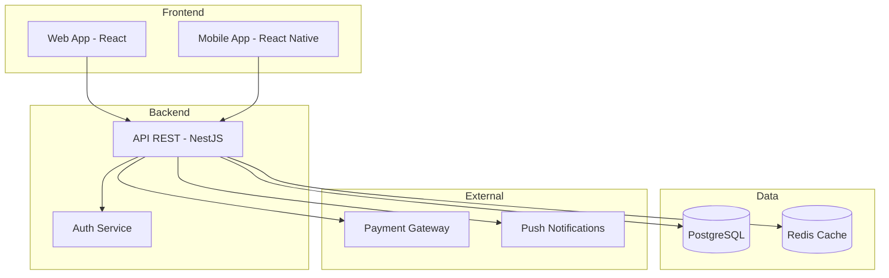

# Project Context Template

> **Uso:** Completar al inicio de cada proyecto. Mantener actualizado.  
> **Es la memoria compartida del proyecto para todos los agentes.**  
> **Ubicación en proyecto:** `.ai/context.md`

---

## Metadata

| Campo | Valor |
|-------|-------|
| **Nombre del Proyecto** | `[nombre]` |
| **Tipo** | `SaaS / App móvil / Sistema interno / API / Automatización` |
| **Estado** | `Planificación / MVP / En producción / Madurez` |
| **Fecha de inicio** | `YYYY-MM-DD` |
| **Última actualización** | `YYYY-MM-DD` |
| **Repositorio principal** | `[URL]` |
| **ai-agents (submodule)** | `.ai/agents/` |

---

## 1. Descripción del Proyecto

> ¿Qué es este proyecto? ¿Qué problema resuelve? ¿Para quién?

**Ejemplo:**
> **LogiTrack** es una plataforma web y móvil para gestión de transporte interprovincial. Permite a operadores de logística administrar sus flotas, viajes y pasajeros. Los usuarios finales son pasajeros que buscan y reservan asientos en rutas programadas.

---

## 2. Objetivos de Negocio

> ¿Qué debe lograr este proyecto a nivel de negocio?

- `[objetivo 1]`
- `[objetivo 2]`
- `[objetivo 3]`

**Ejemplo:**
- Digitalizar el proceso de reserva que actualmente es 100% telefónico
- Reducir el tiempo de gestión del operador en un 60%
- Alcanzar 1000 usuarios activos en los primeros 6 meses

---

## 3. Usuarios / Actores

| Actor | Descripción | Permisos |
|-------|-------------|----------|
| `[Actor]` | `[qué hace]` | `[qué puede hacer]` |

**Ejemplo:**

| Actor | Descripción | Permisos |
|-------|-------------|----------|
| Pasajero | Usuario final que reserva asientos | Ver viajes, reservar, cancelar, ver historial |
| Conductor | Maneja el vehículo y gestiona el viaje | Ver pasajeros de su viaje, iniciar/finalizar viaje |
| Operador | Administra la empresa de transporte | Gestionar conductores, viajes, flotillas, ver reportes |
| Admin Sistema | Administrador de la plataforma | Acceso total |

---

## 4. Stack Tecnológico

| Capa | Tecnología | Versión | Justificación |
|------|-----------|---------|---------------|
| Backend | `[ej: Node.js + NestJS]` | `[versión]` | `[razón]` |
| Base de Datos | `[ej: PostgreSQL + Prisma]` | `[versión]` | `[razón]` |
| Frontend Web | `[ej: React + TypeScript + Vite]` | `[versión]` | `[razón]` |
| App Móvil | `[ej: React Native / Flutter / N/A]` | `[versión]` | `[razón]` |
| Auth | `[ej: Firebase Auth / JWT]` | `[versión]` | `[razón]` |
| Deploy | `[ej: Firebase / AWS / Vercel]` | — | `[razón]` |
| CI/CD | `[ej: GitHub Actions / N/A]` | — | `[razón]` |

---

## 5. Arquitectura General

> Descripción de la arquitectura a alto nivel. Incluir diagrama si es posible.



---

## 6. Módulos del Sistema

| Módulo | Estado | Descripción |
|--------|--------|-------------|
| `auth` | ✅ Completado | Registro, login, recuperación de contraseña |
| `users` | ✅ Completado | Perfil de usuario, preferencias |
| `trips` | 🔄 En desarrollo | Creación y gestión de viajes |
| `bookings` | 📋 Planificado | Reserva de asientos |
| `payments` | 📋 Planificado | Procesamiento de pagos |
| `notifications` | 📋 Planificado | Notificaciones push y email |
| `reports` | 📋 Planificado | Reportes para operadores |

---

## 7. Convenciones del Proyecto

### Nomenclatura

```
Archivos:         kebab-case     (user-profile.service.ts)
Clases:           PascalCase     (UserProfileService)
Variables:        camelCase      (userId, tripDate)
Constantes:       SCREAMING_SNAKE (MAX_SEATS_PER_BOOKING)
Endpoints API:    /api/resources/{id}/sub-resources
```

### Estructura de Carpetas (Backend)

```
src/
├── modules/
│   ├── auth/
│   ├── users/
│   ├── trips/
│   └── bookings/
├── common/
│   ├── guards/
│   ├── interceptors/
│   └── decorators/
└── config/
```

### Git Flow

```
main          → producción
develop       → staging
feat/XXX-desc → features
fix/XXX-desc  → bugfixes
```

### Mensajes de Commit

```
feat(bookings): add seat reservation endpoint
fix(auth): resolve token refresh race condition
refactor(trips): extract seat availability logic
```

---

## 8. Variables de Entorno

> Lista de variables necesarias (sin valores reales).

```bash
# Base de datos
DATABASE_URL=

# Auth
JWT_SECRET=
JWT_EXPIRATION=

# Pagos
PAYMENT_GATEWAY_KEY=
PAYMENT_WEBHOOK_SECRET=

# Firebase (si aplica)
FIREBASE_PROJECT_ID=
FIREBASE_PRIVATE_KEY=

# Notificaciones
FCM_SERVER_KEY=
```

---

## 9. Decisiones Técnicas Importantes

> Decisiones que cualquier agente o desarrollador debe conocer.

| Fecha | Decisión | Razón | Alternativas Descartadas |
|-------|----------|-------|--------------------------|
| `YYYY-MM-DD` | `[decisión]` | `[razón]` | `[alternativas]` |

**Ejemplo:**

| Fecha | Decisión | Razón | Alternativas Descartadas |
|-------|----------|-------|--------------------------|
| 2026-01 | Usar PostgreSQL en lugar de MongoDB | El modelo de datos es altamente relacional | MongoDB (schema libre no necesario) |
| 2026-02 | Usar UUIDs en lugar de IDs autoincrement | Seguridad y portabilidad | Autoincrement (predecible y secuencial) |

---

## 10. Limitaciones y Restricciones Conocidas

> Qué no se puede hacer, qué decisiones están fijas, qué limitaciones existen.

- `[restricción 1]`
- `[restricción 2]`

**Ejemplo:**
- No se puede cambiar la base de datos de PostgreSQL a otra tecnología (decisión del cliente)
- El procesador de pagos es Mercado Pago — no se puede cambiar
- La app móvil debe ser React Native para compartir código con web

---

## Registro de IDs

- Último FEAT asignado: FEAT-000
- Último BUG asignado: BUG-000
- Último ARCH asignado: ARCH-000

---

## 11. Contactos y Recursos

| Rol | Nombre | Contacto |
|-----|--------|----------|
| Product Owner | `[nombre]` | `[email/slack]` |
| Tech Lead | `[nombre]` | `[email/slack]` |
| Desarrollador Principal | `[nombre]` | `[email/slack]` |

**Recursos:**
- Repositorio: `[URL]`
- Board de tareas: `[Jira / Linear / Notion]`
- Documentación: `[Notion / Confluence]`
- Staging: `[URL]`
- Producción: `[URL]`

---

*Template versión 1.0 — ai-agents library*
