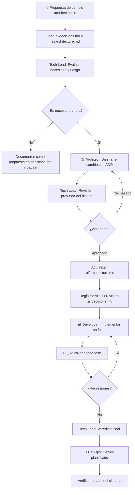

# Workflow: Architecture Change

> **Versión:** 1.0  
> **Agentes involucrados:** Tech Lead → Architect → Tech Lead → Developer → QA → DevOps

---

## Cuándo usar este workflow

- Se propone un cambio que afecta la arquitectura global del sistema
- Se quiere adoptar un nuevo patrón, tecnología o paradigma
- El sistema necesita ser reorganizado a nivel de módulos
- Una decisión de `decisions.md` necesita ser revisada o revertida

---

## Diferencia con un Refactor

| Dimensión | Refactor | Architecture Change |
|-----------|---------|---------------------|
| Comportamiento externo | No cambia | Puede cambiar |
| Impacto | Un módulo o componente | Múltiples módulos o el sistema entero |
| Quién lo diseña | Developer (si es local) o Architect | Architect + aprobación del Tech Lead |
| Riesgo | Bajo a Medio | Alto |
| `architecture.md` | Puede o no actualizarse | **Siempre** se actualiza |

---

## Flujo



---

## Pasos Detallados

### Paso 0 — Contexto y Evaluación Inicial

Antes de proponer cualquier cambio arquitectónico:

1. Leer `.ai/architecture.md` — entender el estado actual completo
2. Leer `.ai/decisions.md` — entender por qué la arquitectura es como es
3. Leer `.ai/context.md` — entender restricciones del proyecto
4. Verificar si ya existe una propuesta similar en `decisions.md`

**Preguntas que el Tech Lead debe responder:**
- ¿Cuál es el problema concreto que este cambio resuelve?
- ¿Cuál es el costo de no hacerlo?
- ¿Hay features activas que dependen de lo que se va a cambiar?
- ¿Cuál es el riesgo de migración?

---

### Paso 1 — Diseño del Cambio (Architect)

**Agente:** Software Architect  
**Activación:**

```
Actúa como el agente Software Architect definido en roles/architect.md.

Contexto del proyecto: [contenido de .ai/context.md]
Arquitectura actual: [contenido de .ai/architecture.md]
Historial de decisiones: [contenido de .ai/decisions.md]

Necesito diseñar un cambio arquitectónico:
[descripción del cambio propuesto]

Problema que resuelve:
[descripción del problema actual]

Restricciones:
- No puede romper [X] en producción
- Debe implementarse en fases para minimizar riesgo
```

**Output requerido:**

1. **Descripción del estado actual** — cómo está hoy
2. **Descripción del estado objetivo** — cómo debería estar
3. **Plan de migración por fases** — cómo llegar del estado actual al objetivo sin downtime
4. **ADR completo** (Architecture Decision Record) con alternativas descartadas
5. **Diagrama Mermaid** del estado objetivo
6. **Impacto en módulos existentes** — qué se afecta y cómo

---

### Paso 2 — Revisión Profunda (Tech Lead)

Esta revisión es más exigente que una revisión de feature normal. El Tech Lead debe evaluar:

**Dimensión técnica:**
- ¿El diseño resuelve el problema sin introducir problemas peores?
- ¿El plan de migración es realista y seguro?
- ¿Existe un rollback claro si algo falla en producción?

**Dimensión de negocio:**
- ¿El impacto en las features en desarrollo activo es manejable?
- ¿El costo de implementación se justifica con el beneficio?
- ¿El timing es el correcto?

**Dimensión operacional:**
- ¿El DevOps puede soportar este cambio con la infraestructura actual?
- ¿Las migraciones de datos son seguras?

---

### Paso 3 — Actualización de Documentos Permanentes

**Antes de comenzar la implementación** (no después):

1. **Actualizar `.ai/architecture.md`** con el estado objetivo del sistema:
   - Marcar claramente qué secciones están "en migración"
   - Describir el estado final objetivo
   
2. **Registrar en `.ai/decisions.md`** con el ADR completo:

```markdown
## ARCH-NNN: [Título de la decisión]

**Fecha:** YYYY-MM-DD  
**Estado:** Vigente  
**Feature relacionada:** N/A (cambio arquitectónico global)

### Contexto
[Por qué fue necesario este cambio]

### Decisión
[Qué se decidió cambiar y cómo]

### Alternativas descartadas
- **[Alternativa A]:** [razón]

### Plan de migración
[Fases del plan]

### Consecuencias
[Impacto esperado y riesgos residuales]
```

---

### Paso 4 — Implementación por Fases (Developer)

Los cambios arquitectónicos se implementan en **fases pequeñas y verificables**, nunca como un único cambio masivo.

**Agente:** Senior Developer  
**Activación por fase:**

```
Actúa como el agente Senior Developer definido en roles/developer.md.

Contexto del proyecto: [contenido de .ai/context.md]
Arquitectura objetivo: [contenido de .ai/architecture.md]
ADR de referencia: ARCH-NNN — [título]

Implementar Fase [N] del cambio arquitectónico:
[descripción de la fase]

La fase anterior ya está en producción y estable.
```

**Principios de implementación por fases:**
- Cada fase debe dejar el sistema en un estado funcional y deployable
- No mezclar fases — una a la vez
- Si una fase genera problemas, pausar y evaluar antes de continuar
- Mantener compatibilidad hacia atrás mientras la migración está en progreso

---

### Paso 5 — Validación por Fase (QA)

Después de cada fase implementada, QA verifica:

1. Los comportamientos existentes del sistema no se rompieron
2. Las métricas de performance no se degradaron
3. Los logs no muestran errores nuevos en producción

---

### Paso 6 — Cierre del Cambio Arquitectónico

Cuando todas las fases están completadas y en producción:

1. **Actualizar `.ai/architecture.md`** para reflejar el estado final (remover las marcas de "en migración")
2. **Actualizar el ADR en `.ai/decisions.md`** con el resultado real vs. el planeado
3. **Actualizar `CHANGELOG.md`** con el cambio arquitectónico y la versión correspondiente
4. **Comunicar al equipo** que el cambio está completo y qué implica para el trabajo futuro

---

## Checklist de Architecture Change

- [ ] Problema identificado con precisión y métricas (no solo "el código está mal")
- [ ] Tech Lead evaluó necesidad, timing y riesgo
- [ ] Architect diseñó el cambio con ADR y plan de migración por fases
- [ ] Tech Lead aprobó el diseño en revisión profunda
- [ ] `.ai/architecture.md` actualizado con estado objetivo antes de implementar
- [ ] `ARCH-NNN` registrado en `.ai/decisions.md`
- [ ] Implementación completada por fases
- [ ] QA validó cada fase sin regresiones
- [ ] Veredicto del Tech Lead: `APROBADO`
- [ ] Todas las fases en producción y estables
- [ ] `.ai/architecture.md` actualizado con estado final (sin marcas de migración)
- [ ] `CHANGELOG.md` actualizado

---

## Señales de que un cambio arquitectónico está mal enfocado

| Señal | Qué significa |
|-------|--------------|
| "No puedo implementarlo en fases" | El alcance es demasiado grande — dividir |
| "Hay que pararlo todo para hacerlo" | Demasiado riesgo — buscar enfoque incremental |
| "El Tech Lead no entiende por qué es necesario" | No está bien justificado — volver al problema |
| "Podemos hacerlo mientras avanzamos la feature" | Mezcla de cambios — separar en PRs distintos |
| "No necesitamos actualizar architecture.md" | No es un cambio arquitectónico — usar workflow de refactor |

---

*Workflow architecture-change v1.0 — ai-agents library | github.com/ezequielmendoza-dev/ai-agents*
