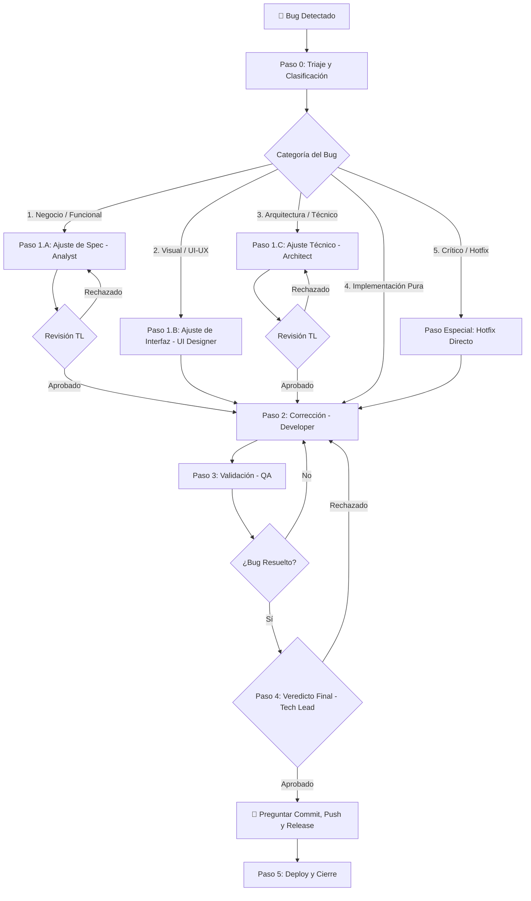

# Workflow: Corrección de Bugs (Bug Fix)

> **Versión:** 2.0  
> **Agentes involucrados:** Dinámico según clasificación (QA, Analyst, UI Designer, Architect, Developer, Tech Lead, DevOps)

---

## Cuándo usar este workflow

- Se detecta un comportamiento anómalo o incorrecto en producción, staging o desarrollo.
- Un usuario, stakeholder o QA reporta un defecto de interfaz, lógica de negocio, arquitectura técnica o rendimiento.

---

## Flujo Dinámico del Pipeline



---

## Pasos Detallados

### Paso 0 — Triaje y Clasificación (QA / Tech Lead)

Al detectar un defecto, se debe abrir un caso de corrección registrando un ID incremental `BUG-NNN` en el registro de IDs de `.ai/context.md` y clasificarlo bajo dos dimensiones:

#### A. Severidad
- 🔴 **Crítico:** Bloqueo completo del sistema, pérdida de integridad de datos o brecha de seguridad. Activa el pipeline de **Hotfix**.
- 🟠 **Alto:** Funcionalidad principal rota sin alternativa de uso temporal (workaround).
- 🟡 **Medio:** Fallo en funcionalidad secundaria o existe un workaround viable.
- 🟢 **Bajo:** Defecto cosmético o comportamiento visual menor que no interrumpe la operación.

#### B. Categoría e Impacto (Activa el Sub-pipeline)

| Categoría | Causa Raíz | Pipeline de Agentes | Entregables Modificados |
| :--- | :--- | :--- | :--- |
| **1. Negocio o Funcional** | Requerimiento original ambiguo o contradictorio. | Analyst ➡️ Tech Lead ➡️ Developer ➡️ QA | `.ai/features/FEAT-XXX/spec.md` o `.ai/business-rules.md` |
| **2. Visual o UI/UX** | Problemas de responsive, fallos visuales o estados omitidos. | UI Designer ➡️ Developer ➡️ QA | `.ai/features/FEAT-XXX/ui-design.md` o `ui-review.md` |
| **3. Arquitectura / Técnico** | Mal diseño de BD, condición de carrera o fallo de integración. | Architect ➡️ Tech Lead ➡️ Developer ➡️ QA | `.ai/features/FEAT-XXX/architecture.md` o `.ai/architecture.md` |
| **4. Implementación Pura** | Error lógico del Developer; la especificación y el diseño visual/técnico son correctos. | Developer ➡️ QA | Solo archivos de código del proyecto |

---

### Paso 1 — Ajuste Documental (Dinámico por Agente)

Según la clasificación del bug, se activa el agente correspondiente para corregir el diseño antes de tocar código:

#### 1.A. Ajuste de Especificación Funcional (Product Analyst)
*Se activa si el bug es funcional o de negocio.*
- **Entrada:** Reporte de bug.
- **Acción:** Corregir `.ai/features/FEAT-XXX/spec.md` (o crearla en `.ai/features/BUG-NNN-slug/spec.md` si es general) y actualizar `.ai/business-rules.md` si aplica.
- **Aprobación:** El Tech Lead debe validar los cambios funcionales antes de que pasen al Developer.

#### 1.B. Ajuste de Especificación Visual (UI Designer)
*Se activa si el bug es de UI/UX, responsive, o a11y.*
- **Entrada:** Reporte de bug + `ui-design.md` anterior.
- **Acción:** Modificar el diseño en `ui-design.md` para corregir la alineación, adaptabilidad o definir el estado visual omitido. No requiere aprobación formal del Tech Lead a menos que modifique tokens de diseño globales.

#### 1.C. Ajuste de Diseño Técnico (Software Architect)
*Se activa si el bug es arquitectónico o de lógica técnica compleja.*
- **Entrada:** Reporte de bug + diseño técnico actual.
- **Acción:** Actualizar `architecture.md` de la feature o el archivo de arquitectura global `.ai/architecture.md`. Si se toma una decisión de diseño de impacto general, registrar una nueva decisión `ARCH-NNN` en `.ai/decisions.md`.
- **Aprobación:** El Tech Lead debe revisar y aprobar el diseño técnico modificado.

---

### Paso 2 — Implementación de la Corrección (Developer)

**Agente:** Senior Developer  
**Entradas:** Reporte del bug + especificaciones modificadas (funcional, visual o técnica, según aplique).

**Activación:**
```
Actúa como el agente Senior Developer definido en roles/developer.md.
Tengo el bug BUG-NNN clasificado como [Categoría] con severidad [Severidad].

Reporte del Bug: [Detalles del comportamiento incorrecto]
Especificación de corrección de referencia:
[Contenido de spec.md, ui-design.md o architecture.md modificados en el Paso 1]
```

**Reglas de Corrección:**
- La intervención de código debe ser **mínima y enfocada** estrictamente a resolver el bug.
- Queda estrictamente prohibido realizar refactorizaciones o agregar features no relacionadas (scope creep) dentro del fix.
- Si el fix requiere modificar APIs o esquemas de BD no contemplados en el Paso 1.C, detener la implementación y notificar al Architect.

---

### Paso 3 — Validación (QA)

**Agente:** QA Engineer  
**Entradas:** Cambios implementados + Reporte del Bug + Checklist de verificación.

**Activación:**
```
Actúa como el agente QA Engineer definido en roles/qa.md.
Estoy validando la resolución de BUG-NNN.

Reporte del bug original: [Detalles]
Cambios realizados: [Lista de commits o descripción de modificaciones de código]
```

**Flujo de Verificación:**
- Si el bug era **Visual/UI-UX**, el QA Engineer (o el UI Designer) debe auditar los cambios contra el checklist [`checklists/ui-review.md`](../checklists/ui-review.md).
- Si el bug era **Técnico**, validar que no haya regresiones en endpoints o integraciones mediante [`checklists/frontend-review.md`](../checklists/frontend-review.md) o [`checklists/backend-review.md`](../checklists/backend-review.md).
- Si la prueba falla, el bug vuelve al **Paso 2** (Developer) con los logs y pasos de fallo documentados.

---

### Paso 4 — Veredicto Final (Tech Lead)

El Tech Lead revisa la trazabilidad del bug:
- ¿Se documentó correctamente el bug y su causa raíz?
- ¿Participaron los agentes necesarios según su impacto?
- ¿El reporte de QA está en `PASS`?
Si todo está conforme, emite el veredicto de `APROBADO` para el deployment.

**Interacción Interactiva (Commit, Push y Release):**
> [!IMPORTANT]
> Una vez que el Tech Lead apruebe la corrección, la IA **debe guiar activamente al usuario** en:
> 1. **Commit y Push:** Proponer un mensaje de commit (ej. `fix(scope): BUG-NNN - descripcion`). Preguntar al usuario si desea proceder.
> 2. **Version Bump:** Una vez hecho el commit, ejecutar `npm run bump:patch -- "BUG-NNN: descripción"` para actualizar la versión (patch), el CHANGELOG y el context.
> 3. **Git Tag:** Crear tag `git tag -a vX.Y.Z -m "BUG-NNN: descripción"` y push con `git push --tags`.
> 4. **Release:** Indicar al usuario si procede release según [`workflows/release.md`](release.md).

---

### Paso 5 — Deploy y Cierre

1. Desplegar el fix a producción (ver [`workflows/release.md`](release.md)).
2. Consolidar cambios en la memoria del proyecto:
   - Si se modificó la arquitectura, actualizar `.ai/architecture.md`.
   - Si se modificó una regla funcional, actualizar `.ai/business-rules.md`.
3. Actualizar `CHANGELOG.md` documentando el bug resuelto en la sección de "Fixed" (esto ya se hizo automáticamente en el Paso 4 con `npm run bump:patch`).

---

## Flujo de Emergencia: Hotfix Crítico 🔴

Si la severidad es **Crítica** y el sistema o datos están comprometidos, el flujo dinámico se optimiza para minimizar el tiempo de inactividad:

1. **Bypass del Pipeline:** El Developer inicia la corrección directamente en una rama `hotfix/BUG-NNN` basada en `main`.
2. **Validación Rápida:** QA realiza pruebas de humo rápidas directamente sobre el fix enfocado.
3. **Despliegue Inmediato:** Se realiza el deploy de emergencia con aprobación verbal del Tech Lead.
4. **Documentación Post-Mortem:** Dentro de las 24 horas posteriores al deploy, el Tech Lead convoca a los agentes (Analyst, Architect, UI Designer, según corresponda) para:
   - Analizar la causa raíz.
   - Actualizar retroactivamente la documentación técnica o funcional (`context.md`, `architecture.md`, `business-rules.md`).
   - Registrar la lección aprendida en `.ai/decisions.md` para prevenir recurrencia.

---

## Checklist de Cierre de Bug Fix

- [ ] Identificado e incrementado el ID del bug `BUG-NNN` en `.ai/context.md`.
- [ ] Bug clasificado por Severidad y Categoría en el triaje.
- [ ] **Documentación ajustada:**
  - [ ] `spec.md` modificada por el Analyst (si el bug fue de Negocio).
  - [ ] `ui-design.md` modificada por el UI Designer (si el bug fue Visual).
  - [ ] `architecture.md` modificada por el Architect (si el bug fue Técnico).
- [ ] Corrección de código enfocada y sin adición de código externo o refactores.
- [ ] QA validó el fix y aplicó el checklist de revisión respectivo (`ui-review`, `frontend-review`, `backend-review`).
- [ ] Veredicto del Tech Lead: `APROBADO`.
- [ ] Despliegue completado con éxito.
- [ ] Memoria del proyecto (`.ai/`) actualizada con las modificaciones definitivas.
- [ ] `CHANGELOG.md` del proyecto actualizado.
- [ ] Versión bumpeda (`npm run bump:patch`).
- [ ] Git tag `vX.Y.Z` creado y pusheado.

---

*Workflow bug-fix v2.0 — ai-agents library | github.com/ezequielmendoza-dev/ai-agents*
