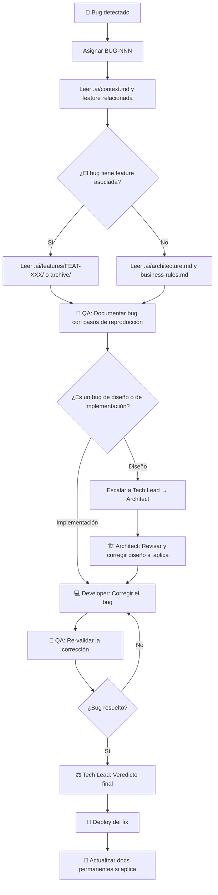

# Workflow: Bug Fix

> **Versión:** 1.0  
> **Agentes involucrados:** QA → Developer → QA (re-validación) → Tech Lead

---

## Cuándo usar este workflow

- Se detectó un defecto en producción o staging
- QA reportó un bug durante el desarrollo de una feature
- Un usuario reportó un comportamiento incorrecto del sistema

---

## Flujo



---

## Pasos Detallados

### Paso 0 — Triaje y Registro

1. **Asignar un ID** al bug: `BUG-NNN` (incrementar el Registro de IDs en `.ai/context.md`)
2. **Determinar la severidad:**
   - 🔴 Crítico — pérdida de datos, sistema caído, seguridad comprometida
   - 🟠 Alto — funcionalidad principal no funciona
   - 🟡 Medio — funcionalidad secundaria afectada, existe workaround
   - 🟢 Bajo — cosmético, no afecta funcionalidad
3. **Identificar si el bug pertenece a una feature específica:**
   - Sí → leer `.ai/features/FEAT-XXX/` (o `archive/FEAT-XXX/` si ya fue archivada)
   - No → leer `.ai/architecture.md` para entender el componente afectado

---

### Paso 1 — Documentación del Bug (QA)

**Agente:** QA Engineer  
**Activación:**

```
Actúa como el agente QA Engineer definido en roles/qa.md.

Contexto del proyecto: [contenido de .ai/context.md]

Necesito documentar el siguiente bug: BUG-NNN

Descripción del comportamiento incorrecto:
[descripción]

Contexto adicional (feature afectada, entorno, datos de prueba):
[contexto]
```

**Output:** Reporte de bug con pasos de reproducción, resultado esperado, resultado actual y severidad.

**Template:** [`templates/bug-report.md`](../templates/bug-report.md)

---

### Paso 2 — Análisis de Causa Raíz

Antes de implementar cualquier corrección, identificar:

- **¿Es un bug de implementación?** El código no respeta el diseño aprobado → corrige el Developer
- **¿Es un bug de diseño?** El diseño estaba incorrecto o incompleto → corrige el Architect, luego el Developer
- **¿Es un bug de especificación?** El requerimiento era ambiguo → aclarar con el Analyst/stakeholder

Si el bug revela un problema en `.ai/business-rules.md` o `.ai/architecture.md`, esos documentos deben actualizarse como parte de la corrección.

---

### Paso 3 — Corrección (Developer)

**Agente:** Senior Developer  
**Activación:**

```
Actúa como el agente Senior Developer definido en roles/developer.md.

Contexto del proyecto: [contenido de .ai/context.md]

Bug a corregir: BUG-NNN

Reporte del bug:
[descripción, pasos de reproducción, resultado esperado/actual]

Diseño de referencia:
[contenido de .ai/architecture.md o .ai/features/FEAT-XXX/architecture.md según aplique]
```

**Reglas para la corrección:**
- La corrección debe ser **mínima y enfocada** — no aprovechar para refactors no relacionados
- Si la corrección requiere cambios arquitectónicos → escalar al Tech Lead antes de implementar
- Documentar claramente qué cambió y por qué

---

### Paso 4 — Re-validación (QA)

**Agente:** QA Engineer  
**Verificar:**
- El bug original fue corregido
- La corrección no introdujo regresiones en funcionalidades relacionadas
- Los casos borde que generaron el bug están cubiertos

**Activación:**

```
Actúa como el agente QA Engineer definido en roles/qa.md.

Contexto del proyecto: [contenido de .ai/context.md]

Estoy re-validando la corrección de: BUG-NNN

Descripción del bug original:
[descripción]

Corrección implementada:
[descripción de los cambios]
```

---

### Paso 5 — Veredicto Final (Tech Lead)

**Agente:** Tech Lead  
**Acción:** Revisar que el bug fue correctamente documentado, corregido y validado. Aprobar el deploy.

---

### Paso 6 — Deployment y Cierre

1. Hacer deploy del fix (ver [`workflows/release.md`](release.md))
2. **Actualizar** documentos permanentes si el bug reveló algo que debía estar documentado:
   - `.ai/business-rules.md` si el bug reveló una regla no documentada
   - `.ai/architecture.md` si el bug reveló un problema de diseño corregido
3. Si la corrección fue en código de una feature archivada → no actualizar la feature en `archive/` (es read-only), sino actualizar `.ai/architecture.md` directamente

---

## Checklist de Cierre de Bug Fix

- [ ] Bug documentado con ID `BUG-NNN` y severidad asignada
- [ ] Causa raíz identificada (implementación / diseño / especificación)
- [ ] Corrección implementada y revisada por Tech Lead si fue de diseño
- [ ] QA validó que el bug fue resuelto
- [ ] QA confirmó ausencia de regresiones
- [ ] Veredicto del Tech Lead: `APROBADO`
- [ ] Deploy realizado
- [ ] Documentos permanentes actualizados si fue necesario
- [ ] `CHANGELOG.md` actualizado con el fix

---

## Escalación de bugs críticos 🔴

Cuando el bug es de severidad **Crítica**:

1. **Notificar al Tech Lead inmediatamente** — no esperar el flujo normal
2. **Evaluar si se necesita un hotfix** (branch `hotfix/slug` desde `main`)
3. **Decidir si la funcionalidad debe desactivarse** temporalmente hasta el fix
4. **Comunicar al stakeholder** el impacto y el ETA de la corrección
5. **Post-mortem:** después del fix, documentar en `.ai/decisions.md` qué ocurrió y qué se cambió para evitar que se repita

---

*Workflow bug-fix v1.0 — ai-agents library | github.com/ezequielmendoza-dev/ai-agents*
