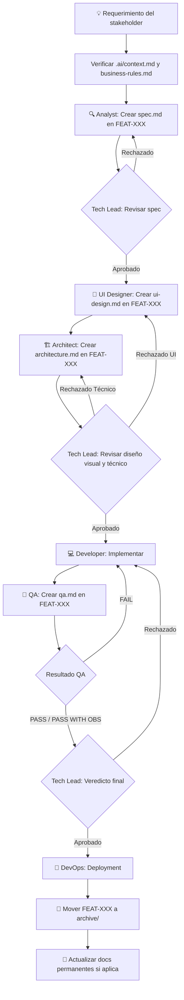

# Workflow: Nueva Feature

> **Versión:** 1.0  
> **Agentes involucrados:** Analyst → UI Designer → Architect → Tech Lead → Developer → QA → DevOps (si aplica)

---

## Cuándo usar este workflow

- Se solicita implementar una funcionalidad nueva
- La feature no existe en ninguna forma en el sistema
- Hay un requerimiento del stakeholder que necesita especificarse y construirse

---

## Flujo



---

## Pasos Detallados

### Paso 0 — Preparación

Antes de iniciar cualquier trabajo:

1. Leer `.ai/context.md` para entender el sistema actual
2. Leer `.ai/business-rules.md` para conocer las restricciones de negocio
3. Leer `.ai/architecture.md` para entender la arquitectura vigente
4. Consultar `.ai/decisions.md` para conocer decisiones relevantes anteriores
5. **Asignar el ID de la feature** consultando el Registro de IDs en `context.md`
6. Crear la carpeta `.ai/features/FEAT-NNN-slug/`

```bash
mkdir -p .ai/features/FEAT-NNN-slug
touch .ai/features/FEAT-NNN-slug/spec.md
touch .ai/features/FEAT-NNN-slug/ui-design.md
touch .ai/features/FEAT-NNN-slug/architecture.md
touch .ai/features/FEAT-NNN-slug/qa.md
touch .ai/features/FEAT-NNN-slug/decision.md
```

7. Actualizar el Registro de IDs en `.ai/context.md`

---

### Paso 1 — Especificación Funcional (Analyst)

**Agente:** Product Analyst  
**Output:** `.ai/features/FEAT-NNN-slug/spec.md`  
**Template:** [`templates/feature-spec.md`](../templates/feature-spec.md)

**Activación:**

```
Actúa como el agente Product Analyst definido en roles/analyst.md.

Contexto del proyecto: [contenido de .ai/context.md]
Reglas de negocio: [contenido de .ai/business-rules.md]

Feature a especificar: FEAT-NNN — [nombre]

Requerimiento:
[descripción del requerimiento]
```

**Criterio de salida:** `spec.md` completa, sin preguntas abiertas bloqueantes, lista para revisión del Tech Lead.

---

### Paso 2 — Revisión de Especificación (Tech Lead)

**Agente:** Tech Lead  
**Veredictos posibles:** APROBADO / APROBADO CON OBSERVACIONES / RECHAZADO

Si es **RECHAZADO** → volver al Paso 1 con el feedback del Tech Lead.  
Si es **APROBADO** → continuar al Paso 3.

**Activación:**

```
Actúa como el agente Tech Lead definido en roles/tech-lead.md.

Contexto del proyecto: [contenido de .ai/context.md]

Estoy presentando para revisión: feature-spec
### Paso 3 — Diseño de Interfaz (UI Designer)

**Agente:** UI Designer  
**Output:** `.ai/features/FEAT-NNN-slug/ui-design.md`  
**Template:** [`templates/ui-design-spec.md`](../templates/ui-design-spec.md)

**Activación:**

```
Actúa como el agente UI Designer definido en roles/ui-designer.md.

Contexto del proyecto: [contenido de .ai/context.md]

Especificación funcional de referencia:
[contenido de .ai/features/FEAT-NNN-slug/spec.md]
```

**Criterio de salida:** `ui-design.md` completa, con la arquitectura de información, layouts y componentes diseñados para todos los viewports, lista para el desarrollo.

---

### Paso 4 — Diseño Técnico (Architect)

**Agente:** Software Architect  
**Output:** `.ai/features/FEAT-NNN-slug/architecture.md`  
**Template:** [`templates/architecture-spec.md`](../templates/architecture-spec.md)

Si el diseño requiere cambios en la arquitectura global, actualizar `.ai/architecture.md` en este paso.

**Activación:**

```
Actúa como el agente Software Architect definido en roles/architect.md.

Contexto del proyecto: [contenido de .ai/context.md]
Arquitectura actual: [contenido de .ai/architecture.md]

Especificación funcional a diseñar:
[contenido de .ai/features/FEAT-NNN-slug/spec.md]

Diseño visual de referencia:
[contenido de .ai/features/FEAT-NNN-slug/ui-design.md]
```

---

### Paso 5 — Revisión de Diseño (Tech Lead)

**Agente:** Tech Lead  
**Veredictos posibles:** APROBADO / APROBADO CON OBSERVACIONES / RECHAZADO

Si es **RECHAZADO** (por diseño técnico o visual) → volver al Paso 3 o 4 con el feedback del Tech Lead.  
Si hay decisiones de arquitectura importantes → registrar en `.ai/decisions.md`.  
Si es **APROBADO** → continuar al Paso 6.

---

### Paso 6 — Implementación (Developer)

**Agente:** Senior Developer  
**Template de referencia:** [`templates/technical-task.md`](../templates/technical-task.md)

**Activación:**

```
Actúa como el agente Senior Developer definido en roles/developer.md.

Contexto del proyecto: [contenido de .ai/context.md]

Tarea a implementar:
[descripción de la tarea técnica]

Especificación de referencia:
[contenido de .ai/features/FEAT-NNN-slug/spec.md]

Diseño visual de referencia:
[contenido de .ai/features/FEAT-NNN-slug/ui-design.md]

Diseño técnico de referencia:
[contenido de .ai/features/FEAT-NNN-slug/architecture.md]
```

**Criterio de salida:** Implementación completa, funcional y fiel a la UI y la arquitectura, lista para QA.

---

### Paso 7 — Validación de Calidad (QA)

**Agente:** QA Engineer  
**Output:** `.ai/features/FEAT-NNN-slug/qa.md`  
**Template:** [`templates/qa-report.md`](../templates/qa-report.md)

**Activación:**

```
Actúa como el agente QA Engineer definido en roles/qa.md.

Contexto del proyecto: [contenido de .ai/context.md]

Feature spec de referencia:
[contenido de .ai/features/FEAT-NNN-slug/spec.md]

Diseño visual de referencia:
[contenido de .ai/features/FEAT-NNN-slug/ui-design.md]

Diseño técnico de referencia:
[contenido de .ai/features/FEAT-NNN-slug/architecture.md]

Implementación a revisar:
[descripción de los cambios implementados]
```

Si el resultado es **FAIL** → volver al Paso 6 con los bugs reportados.  
Si el resultado es **PASS** o **PASS WITH OBSERVATIONS** → continuar al Paso 8.

---

### Paso 8 — Final Veredicto (Tech Lead)

**Agente:** Tech Lead  
**Acción:** Revisar el reporte de QA y emitir veredicto final de deployment.

---

### Paso 9 — Deployment (DevOps)

**Agente:** DevOps Engineer (bajo demanda del Tech Lead)  
**Workflow:** Ver [`workflows/release.md`](release.md) para el proceso de deployment.

---

### Paso 10 — Cierre de Feature

Cuando la feature está en producción:

1. **Mover** la carpeta al archivo histórico:
   ```bash
   mv .ai/features/FEAT-NNN-slug .ai/archive/FEAT-NNN-slug
   ```

2. **Actualizar** los documentos permanentes si la feature cambió algo global:
   - `.ai/architecture.md` si cambió la arquitectura del sistema
   - `.ai/business-rules.md` si se incorporaron nuevas reglas permanentes
   - `.ai/glossary.md` si aparecieron nuevos términos del dominio
   - `.ai/decisions.md` si hay decisiones que aplican globalmente

3. **Actualizar** el `CHANGELOG.md` del proyecto con la feature completada.

---

## Checklist de Cierre de Feature

- [ ] `spec.md` en estado `Aprobada`
- [ ] `ui-design.md` en estado `Aprobado`
- [ ] `architecture.md` en estado `Aprobado`
- [ ] `qa.md` en estado `PASS` o `PASS WITH OBSERVATIONS` resueltas
- [ ] Veredicto del Tech Lead: `APROBADO`
- [ ] Código en rama principal / producción
- [ ] Documentos permanentes actualizados si fue necesario
- [ ] Feature movida a `archive/`
- [ ] `CHANGELOG.md` actualizado

---

*Workflow new-feature v1.0 — ai-agents library | github.com/ezequielmendoza-dev/ai-agents*
