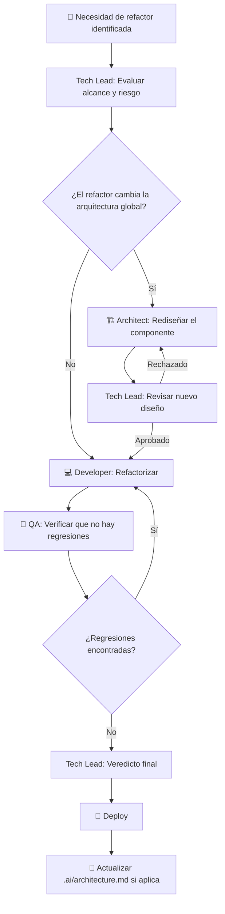

# Workflow: Refactor

> **Versión:** 1.0  
> **Agentes involucrados:** Tech Lead → Architect → Developer → QA

---

## Cuándo usar este workflow

- Hay deuda técnica identificada que impide trabajar con fluidez
- Un módulo necesita ser reestructurado sin cambiar su comportamiento externo
- Se detectó una violación de arquitectura que debe corregirse
- El Tech Lead detectó un problema de mantenibilidad durante una revisión

---

## Principio Fundamental

> Un refactor **no cambia el comportamiento observable del sistema**.  
> Si cambia algo visible para el usuario o para otras APIs → es una feature o un bug fix, no un refactor.

---

## Flujo



---

## Pasos Detallados

### Paso 0 — Evaluación de Necesidad (Tech Lead)

Antes de aprobar cualquier refactor, el Tech Lead debe responder:

1. **¿Cuál es el problema concreto?** (no "el código está feo", sino "el módulo X tiene N responsabilidades que dificultan Y")
2. **¿Cuál es el beneficio esperado?** (mantenibilidad, performance, testabilidad)
3. **¿Cuál es el riesgo?** (qué puede romperse, qué tests existen)
4. **¿Es el momento correcto?** (¿hay features activas en el mismo módulo?)
5. **¿Cambia algo visible externamente?** Si sí → no es un refactor puro

**Leer antes de decidir:**
- `.ai/context.md` — convenciones del proyecto
- `.ai/architecture.md` — arquitectura actual
- `.ai/decisions.md` — por qué está diseñado así

---

### Paso 1 — Diseño del Refactor (Architect, si aplica)

Solo necesario si el refactor cambia la arquitectura global del sistema.

**Agente:** Software Architect  
**Activación:**

```
Actúa como el agente Software Architect definido en agents/architect.md.

Contexto del proyecto: [contenido de .ai/context.md]
Arquitectura actual: [contenido de .ai/architecture.md]

Necesito diseñar un refactor del siguiente componente:
[nombre del componente y descripción del problema actual]

El refactor NO debe cambiar el comportamiento externo del sistema.
Objetivo: [objetivo del refactor]
```

**Output:** Diseño del estado post-refactor con la lista de cambios y el orden de implementación.

Si el resultado cambia `architecture.md` → actualizar como parte de este paso.

---

### Paso 2 — Revisión del Diseño (Tech Lead)

Si el Architect diseñó el refactor, el Tech Lead lo revisa antes de implementar.

**Verificar:**
- El refactor resuelve el problema identificado
- No introduce complejidad innecesaria
- No cambia el comportamiento externo
- El orden de implementación es correcto y seguro

---

### Paso 3 — Implementación (Developer)

**Agente:** Senior Developer  
**Activación:**

```
Actúa como el agente Senior Developer definido en agents/developer.md.

Contexto del proyecto: [contenido de .ai/context.md]

Refactor a implementar:
[descripción del refactor aprobado]

Restricción crítica: el comportamiento externo del sistema NO debe cambiar.

Componente afectado:
[nombre del módulo/archivo/función]
```

**Reglas de implementación:**
- Hacer el refactor en pasos pequeños y verificables, no en un único commit gigante
- Mantener los tests existentes — si los tests fallan, es un bug, no un refactor
- Si durante el refactor se detecta un bug → documentarlo y abrir un `BUG-NNN` separado. No corregirlo en el mismo PR.
- Documentar qué cambió y por qué para que QA pueda entender el alcance

---

### Paso 4 — Validación de Regresiones (QA)

**Agente:** QA Engineer  
**Objetivo:** Verificar que el refactor no rompió ningún comportamiento existente.

**Activación:**

```
Actúa como el agente QA Engineer definido en agents/qa.md.

Contexto del proyecto: [contenido de .ai/context.md]

Estoy validando un refactor del componente: [nombre]

El refactor NO debe cambiar el comportamiento externo del sistema.

Cambios realizados:
[descripción de los cambios del Developer]

Por favor, verifica que todos los comportamientos existentes siguen funcionando correctamente.
```

**Criterio de éxito:** Todos los criterios de aceptación previamente existentes siguen cumpliéndose. No se abrieron bugs nuevos.

---

### Paso 5 — Cierre del Refactor

1. **Deploy** (ver [`workflows/release.md`](release.md))
2. **Actualizar** `.ai/architecture.md` si el refactor cambió algo en la arquitectura global
3. **Registrar** en `.ai/decisions.md` si el refactor implicó una decisión técnica importante (por qué se eligió esta nueva estructura)
4. Actualizar `CHANGELOG.md` del proyecto

---

## Checklist de Refactor

- [ ] Problema a resolver identificado con precisión
- [ ] Tech Lead aprobó que es necesario y el momento es correcto
- [ ] Architect diseñó el cambio (si afecta arquitectura global)
- [ ] Implementación en pasos pequeños y verificables
- [ ] Tests existentes pasan sin modificaciones (si fallan, hay un bug)
- [ ] QA confirmó ausencia de regresiones
- [ ] Veredicto del Tech Lead: `APROBADO`
- [ ] Deploy realizado
- [ ] `architecture.md` actualizado si fue necesario
- [ ] `decisions.md` actualizado si hubo una decisión técnica relevante

---

## Anti-patrones de refactor

| Anti-patrón | Problema | Alternativa |
|------------|---------|-------------|
| "Refactorizar y agregar la feature al mismo tiempo" | Mezcla dos tipos de cambio, hace difícil el debugging | Dos PRs separados: primero el refactor, luego la feature |
| "El refactor está casi listo, cambio rápido esta regla de negocio" | Ya no es un refactor | Parar, crear un BUG o FEAT separado |
| "El refactor es tan grande que no puedo separarlo" | El alcance es demasiado amplio | Dividir en múltiples refactors pequeños y secuenciales |
| "Vamos a refactorizar todo antes de la siguiente feature" | Big-bang refactor de alto riesgo | Refactorizar solo lo necesario para que la feature entre bien |

---

*Workflow refactor v1.0 — ai-agents library | github.com/ezequielmendoza-dev/ai-agents*
