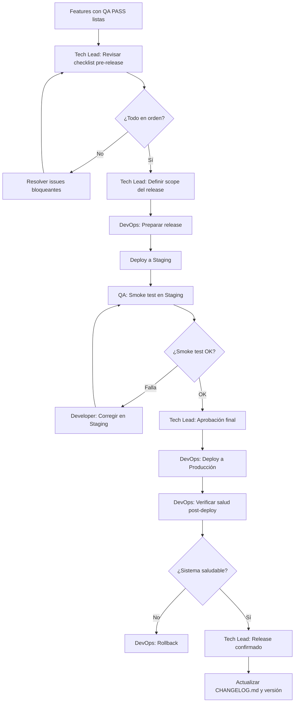
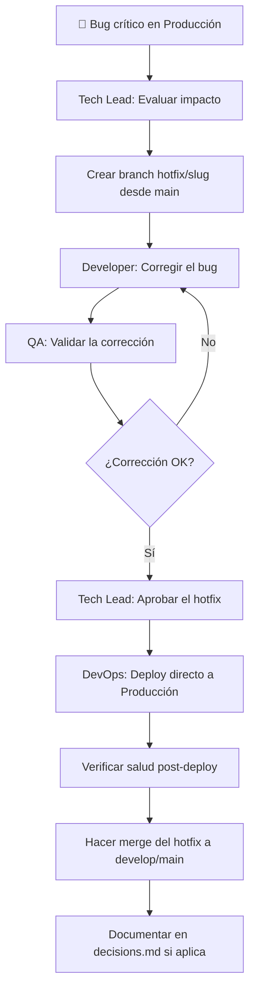

# Workflow: Release

> **Versión:** 1.0  
> **Agentes involucrados:** Tech Lead → DevOps

---

## Cuándo usar este workflow

- Una o más features pasaron QA y están listas para producción
- Hay una corrección de bug crítico que debe desplegarse
- Se definió una cadencia de releases (semanal, quincenal, etc.)

---

## Tipos de Release

| Tipo | Descripción | Ejemplo de versión |
|------|-------------|-------------------|
| **Major** | Cambios que rompen compatibilidad hacia atrás | `1.0.0` → `2.0.0` |
| **Minor** | Nuevas funcionalidades sin breaking changes | `1.0.0` → `1.1.0` |
| **Patch** | Bug fixes y correcciones menores | `1.0.0` → `1.0.1` |
| **Hotfix** | Corrección urgente de bug crítico en producción | Branch `hotfix/` desde `main` |

---

## Flujo — Release Normal



---

## Pasos Detallados

### Paso 0 — Leer el estado actual

Antes de cualquier release:

1. Leer `.ai/context.md` para conocer el stack y entornos
2. Revisar todas las features en `.ai/features/` con QA PASS
3. Revisar `.ai/decisions.md` por decisiones recientes que impacten el release

---

### Paso 1 — Checklist Pre-Release (Tech Lead)

**Agente:** Tech Lead  
**Verificar para cada feature incluida en el release:**

- [ ] `spec.md` en estado `Aprobada`
- [ ] `architecture.md` en estado `Aprobado`
- [ ] `qa.md` con resultado `PASS` o `PASS WITH OBSERVATIONS` resueltas
- [ ] Veredicto del Tech Lead previo: `APROBADO`
- [ ] Código en rama principal o rama de release
- [ ] Sin conflictos de merge pendientes

**Verificar a nivel de sistema:**

- [ ] No hay bugs críticos abiertos (`BUG-NNN` con severidad 🔴) sin resolver
- [ ] Las migraciones de base de datos están preparadas y testeadas en staging
- [ ] Las variables de entorno de producción están actualizadas
- [ ] El plan de rollback está documentado

---

### Paso 2 — Scope del Release (Tech Lead)

Definir explícitamente:

```markdown
## Release vX.Y.Z — [Fecha]

### Features incluidas
- FEAT-NNN: [nombre]
- FEAT-NNN: [nombre]

### Bug fixes incluidos
- BUG-NNN: [descripción]

### Features NO incluidas (quedan para el siguiente release)
- FEAT-NNN: [nombre] — [razón por la que queda afuera]
```

---

### Paso 3 — Preparación del Release (DevOps)

**Agente:** DevOps Engineer  
**Activación:**

```
Actúa como el agente DevOps Engineer definido en agents/devops.md.

Contexto del proyecto: [contenido de .ai/context.md]

Tarea: Preparar el release vX.Y.Z

Features incluidas:
[lista de FEAT-NNN]

Bug fixes incluidos:
[lista de BUG-NNN]

Migraciones de base de datos requeridas:
[lista si aplica]
```

**Output:** Checklist de deployment, comandos de deploy, plan de rollback.

---

### Paso 4 — Deploy a Staging y Smoke Test

1. DevOps despliega a Staging
2. QA ejecuta **smoke test**: verificar que los flujos principales de cada feature incluida funcionan correctamente
3. Si algo falla en Staging → corregir antes de continuar. No ir a Producción con issues conocidos.

---

### Paso 5 — Deploy a Producción

**Solo después de que el smoke test en Staging sea exitoso.**

**Activación:**

```
Actúa como el agente DevOps Engineer definido en agents/devops.md.

Tarea: Deploy a Producción del release vX.Y.Z

El smoke test en Staging fue exitoso.

Plan de rollback aprobado:
[pasos de rollback]
```

---

### Paso 6 — Verificación Post-Deploy

Inmediatamente después del deploy a Producción:

- [ ] Verificar que el sistema responde correctamente (health checks)
- [ ] Verificar que las migraciones de DB corrieron sin errores
- [ ] Monitorear logs por errores inesperados durante los primeros 15 minutos
- [ ] Ejecutar smoke test en Producción (flujos críticos)

Si algo falla → ejecutar el plan de rollback inmediatamente.

---

### Paso 7 — Cierre del Release

1. **Actualizar `CHANGELOG.md`** del proyecto con las features y fixes del release
2. **Mover features** a `archive/` en `.ai/`:
   ```bash
   mv .ai/features/FEAT-NNN-slug .ai/archive/FEAT-NNN-slug
   ```
3. **Actualizar documentos permanentes** si el release cambió algo global:
   - `.ai/architecture.md`
   - `.ai/business-rules.md`
   - `.ai/glossary.md`
4. **Crear tag de Git** con la versión del release:
   ```bash
   git tag -a vX.Y.Z -m "Release vX.Y.Z — [descripción breve]"
   git push origin vX.Y.Z
   ```

---

## Flujo — Hotfix (bug crítico en producción)



**Reglas del hotfix:**
- Un hotfix es solo para bugs críticos que afectan producción ahora
- Va directo a Producción sin esperar el ciclo de release normal
- Debe hacerse merge también a la rama de desarrollo para no perder la corrección
- Post-mortem documentado en `.ai/decisions.md` para entender y prevenir

---

## Plan de Rollback Estándar

Si el deploy a Producción genera un problema que no puede corregirse en minutos:

1. **Notificar** al equipo y al Tech Lead del inicio del rollback
2. **Revertir** el deploy (según la estrategia: redeploy de la versión anterior, feature flags, etc.)
3. **Verificar** que el sistema volvió al estado estable anterior
4. **Documentar** qué ocurrió en `.ai/decisions.md`
5. **Postmortem** para entender la causa raíz antes de reintentar el release

---

*Workflow release v1.0 — ai-agents library | github.com/ezequielmendoza-dev/ai-agents*
